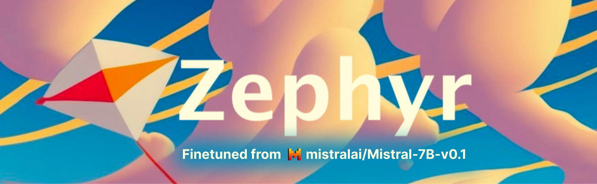

# Zephyr - HuggingFace의 DPO 적용 사례

  

## HuggingFace Zephyr 시리즈 - 2023.10

Zephyr는 HuggingFace의 H4 팀이 개발한 **오픈소스** LLM 시리즈입니다. Mistral-7B를 기반으로 하며, 기존 RLHF(Reinforcement Learning from Human Feedback) 대신 DPO(Direct Preference Optimization)라는 효율적인 alignment 기법을 적용한 것이 특징입니다. 적은 컴퓨팅 자원으로도 고품질 대화 모델을 만들 수 있음을 입증했습니다.

- **개발 배경**: 복잡한 RLHF 과정 없이도 효과적으로 LLM을 alignment 할 수 있는 방법을 연구하고자 했습니다, RLHF (또는 PPO) 는 너무 어렵거든요...
- **데이터에서 인간의 개입 제거!**: Human 피드백 없이 AI 생성 데이터만으로 alignment이 가능합니다.
- **진정한 오픈소스**: 재현 문서를 제공합니다! [Alignment Handbook](https://github.com/huggingface/alignment-handbook/)

## 데이터 및 방법론

> Zephyr 7B alpha & beta
 
### 1-1. 기반 모델 및 SFT 과정
- **기반 모델**: Mistral-7B-v0.1을 사용했습니다.
- **지도 학습 미세조정(SFT)**: UltraChat 데이터셋(ChatGPT로 생성된 147만 개의 대화)을 정제하여 사용했습니다.
- **데이터 정제 과정**: 
    - 원본 데이터에서 발견된 대문자 오류 수정(truecasing)
    - 과도한 거부 응답이나 면책 문구 제거
    - 약 20만 개의 고품질 예제를 선별하여 최종 훈련에 사용

### 1-2. DPO alignment 과정
- **선호도 데이터**: UltraFeedback 데이터셋(6.4만 개의 프롬프트와 각각 4개의 응답)을 활용했습니다.
- **AI 피드백**: GPT-4가 각 응답을 유용성, 정직성 등 여러 기준으로 평가한 점수를 사용했습니다.
- **선호도 쌍 구성**: 각 프롬프트에 대해 가장 높은 점수의 응답을 "선호" 응답으로, 나머지 중 하나를 무작위로 "비선호" 응답으로 선택했습니다.
- **DPO 훈련**: 
    - SFT 모델을 참조 모델로 사용
    - 선호 응답의 확률을 높이고 비선호 응답의 확률을 낮추는 방향으로 모델 가중치 조정
    - HuggingFace의 TRL 라이브러리와 DPOTrainer 활용

---

> Zephyr ORPO

### 2. ORPO(Odds Ratio Preference Optimization)
- Zephyr 시리즈의 최신 모델인 Zephyr-141B에 적용된 새로운 alignment 알고리즘입니다.
- DPO와 달리 참조 모델이 필요 없어 SFT 단계를 건너뛸 수 있습니다.
- 단 7천 개의 선호도 예제만으로 1.3시간 내에 대규모 모델(141B) alignment이 가능했습니다.

## 성능 및 영향

### 주요 벤치마크 결과
- **Zephyr-7B beta**: MT-Bench에서 7.34점을 기록하며 당시 (2023) 7B 모델 중 최고 성능을 달성했습니다.
- **Zephyr-141B ORPO**: MT-Bench에서 8.17점을 기록하며 최고 수준의 오픈소스 모델들과 경쟁력을 보였습니다.

### DPO의 장점
- **단순성**: 복잡한 RL 루프 없이 정적 데이터셋에서 직접 선호도를 학습합니다.
- **효율성**: 보상 모델 훈련이나 온라인 샘플링이 필요 없어 훈련 시간과 비용이 크게 절감됩니다.
- **안정성**: RL 훈련에서 흔히 발생하는 불안정성 문제가 없습니다.
- **AI 피드백 활용**: Human Labeling 없이 GPT-4 같은 강력한 모델의 평가를 활용할 수 있습니다.

### 라이선스 및 접근성
- **오픈소스 공개**: Zephyr-7B 모델들은 MIT 라이선스로, Zephyr-141B는 Apache 2.0 라이선스로 공개되었습니다.
- **상업적 활용**: 두 라이선스 모두 상업적 사용과 연구를 최소한의 제약으로 허용합니다.

### 제한 사항
- **안전성 alignment 부재**: Zephyr 모델들은 RLHF 안전성 훈련을 거치지 않아 유해한 콘텐츠를 생성할 가능성이 있습니다.
- **특정 도메인 한계**: 코딩이나 수학 같은 복잡한 영역에서는 대형 독점 모델에 비해 성능이 떨어집니다.

## 의의

### alignment 기술 발전
- DPO와 ORPO 같은 효율적인 alignment 기법의 실용성을 입증했습니다.
- RLHF의 복잡성과 비용을 크게 줄이는 대안을 제시했습니다.

### 오픈소스 생태계 기여
- 고성능 alignment 모델을 오픈소스로 공개하여 연구 커뮤니티에 기여했습니다.
- "Alignment Handbook" 저장소를 통해 alignment 기술을 대중화했습니다.

참고 자료:
- Lewis Tunstall et al. "Zephyr: Direct Distillation of LM Alignment." arXiv preprint 2310.16944 (2023)
- HuggingFace H4 - Zephyr 모델 카드 (https://huggingface.co/HuggingFaceH4/zephyr-7b-beta)
- HuggingFace 블로그 - "Preference Tuning LLMs with Direct Preference Optimization Methods" (2023) 