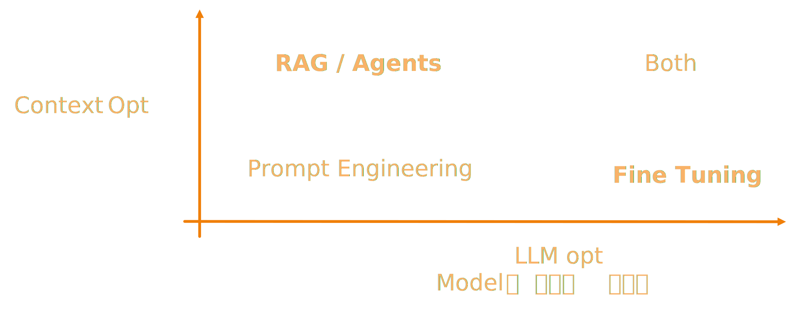

# Fine-Tuning 기본 개념

## 개요
- Fine-Tuning이란?  
    - Pre-Trained (이미 튜닝이 되어 있는 것도 포함) LLM을 특정 작업/도메인에 맞게 추가 학습하는 과정입니다.

- **기대 효과**   
    - **도메인 적합성 향상**: 일반 LLM이 다루지 못했던 전문 분야 데이터를 학습함으로써, 해당 분야에 더 정확하고 적절한 응답을 생성할 수 있습니다. (예: 범용 모델에 의료 기록 데이터를 파인튜닝하여 의료 상담 질문에 전문적인 답변을 생성)
    - **특정 작업 성능 향상**: 요약, 번역, 질의응답 등 특정 태스크에 최적화된 데이터로 미세 조정하면 그 작업에 대한 성능이 크게 향상됩니다.
    - **스타일 및 일관성 부여**: 기업이나 사용자만의 **문체(style)**나 포맷을 모델에게 학습시켜, 출력 결과가 일관된 톤과 형식을 유지하도록 만들 수 있습니다.
    - **업데이트 및 개선**: 새로운 트렌드나 정보를 반영한 데이터로 지속적으로 모델을 재훈련(Continual Tuning)하면, 모델이 최신 정보에 뒤처지지 않고 계속 발전된 성능을 유지할 수 있습니다.
  
---

> **질문:** 결국 모델을 변경 (개선) 해서 잘 활용을 해보겠다는 것인데, 다른 방법으로 하면 안돼나요? "도메인 적합성" 같은 경우는 RAG가 더 효과적이지 않나요?
>
> **답변:** RAG와 Fine-Tuning은 기대 효과의 종류가 다릅니다!

## RAG 와 Fine-Tuning의 차이점

- RAG vs. Fine-Tuning
    - RAG: 외부 지식 소스 활용합니다, 실시간을 포함한 다양한 정보 접근이 가능하나, vectorDB 와 같은 별도 인프라가 필요합니다. 
    - Fine-Tuning: RAG 만으로는 풀리지 않는 문제들을 풀 수 있습니다, 반대로 파인튜닝으로 불가능한 문제들도 있죠. 이는 보다 자세한 예시를 통해 설명하는 것이 좋겠습니다.

한 회사에서 직원들의 슬랙 메세지로 파인 튜닝을 하고 일을 시켜봤다고 합니다. 

### 실제 사례: 회사 슬랙 메시지로 파인튜닝한 경우

다음은 한 회사에서 직원들의 슬랙 메시지로 모델을 파인튜닝한 후 발생한 상황입니다:

> **User**: 프롬프트 엔지니어링에 대해 블로그 글 써줘!  
> **Assistant**: 네, 내일 아침에 할게요  
> **User**: 지금 당장 써줘  
> **Assistant**: 네 (안함)  

짜잔! 기대한 것은 회사의 내부 지식들을 익혀서 진짜 직원들 처럼 일을 하기를 바랬으나, 일을 미루는 직원들의 태도를 배웠습니다.   
답변 스타일을 학습한 것이죠. 물론 슬랙 메세지에 녹아있던 사내 지식들도 배웠을 테지만 그 기능이 바로 뽑혀나오지는 않습니다. 프롬프팅을 추가적으로 더 잘해줘야 합니다.   

> 사내 지식을 기반으로 즉각적인 작업 수행이 필요하다면, 파인튜닝보다는 RAG가 더 효과적인 방법입니다. 최적의 결과를 위해서는 두 방법을 병행하는 것이 좋습니다.

RAG 는 Context Optimization, 파인튜닝은 Model Optimization 입니다. 두 행위는 어느 정도 orthogonal 하며, 상황에 맞게  잘 활용하는 것이 중요합니다.  

아래 영상은 OpenAI 의 devday 에서 개발자들을 대상으로 본인들의 RAG/파인튜닝 경험을 바탕으로한 가이드 내용입니다. 참고하시면 도움이 만이 되실 거에요. 

<iframe width="560" height="315" src="https://www.youtube.com/embed/ahnGLM-RC1Y" title="YouTube video player" frameborder="0" allow="accelerometer; autoplay; clipboard-write; encrypted-media; gyroscope; picture-in-picture" allowfullscreen></iframe>

- (참고) Prompting vs. Fine-Tuning
    - Prompting: 모델 수정 없이 입력을 최적화. 빠르고 간단하나 기존 지식 범위를 늘릴 수는 없습니다, 모델의 잠재능력을 최대한 끌어내는 것이 최선이죠.
    - Fine-Tuning: 모델 weight 를 변경. 리소스가 필요하나 모델 자체의 잠재된 능력을 바꿔주니 더 포텐셜이 높습니다, 현실에서는 파인튜닝을 해도 프롬프팅은 당연히 같이 더 합니다.
    - 사람에 비유하자면, 직원에게 메뉴얼을 잘 주는게 프롬프팅이고, 직원을 교육시키는 것이 파인튜닝입니다. 

---

 
## Fine-Tuning의 종류

- 기법에 따른 분류  
    - Full Fine-Tuning: 모델의 모든 파라미터 업데이트 합니다.  
    - Parameter-Efficient Fine-Tuning: 어댑터 등 일부 파라미터만 조정합니다. 대표적으로 LoRA 가 있습니다. 

- 목적에 따른 분류
    - Continuous Pretraining: Pretrain 모델에 새로운 코퍼스(ex. 지식)을 학습시키기 위한 파인튜닝입니다.
    - Instruction Tuning: Pretrain 모델에 채팅 기능 (지시를 따르게 하기) 을 추가하기 위한 파인튜닝입니다.
    - Domain QA Tuning: 특정 도메인(의료, 법률 등)의 데이터를 학습시켜 전문적인 답변을 생성할 수 있게 하는 파인튜닝입니다.
    - Refusal Training: 비윤리적인 응답을 금지시키기 위한 파인튜닝입니다.
    - Style Tuning: 답변의 형식 변화를 위한 파인튜닝입니다 (길이, 말투 등).
