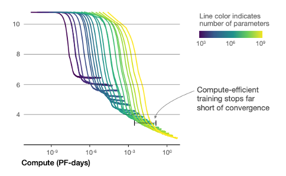
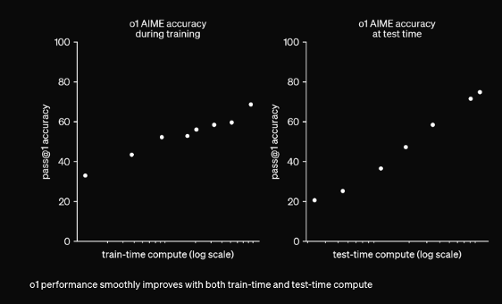

# LLM 패러다임

## 스케일링 법칙 (Scaling Law)

| 💡 필자의 의견 |
|---------|
| Machine Learning 시대부터 Deep Learning, LLM, 최근의 Reasoning 모델까지 모든 흐름을 하나로 관통하는 키워드를 뽑으라면 저는 단연코 "Scaling Law" 를 뽑겠습니다. |

### 스케일링 법칙의 의미와 중요성
- 모델 사이즈, 데이터 양, 컴퓨팅 자원을 확장함에 따라 모델 성능이 체계적으로 향상되는 경험적 법칙입니다.
- LLM 의 성능 (여기서는 test loss) 은 사이즈를 키우면 좋아진다는 경향을 실험적으로 발견한 페이퍼입니다. 
- 2020년대에 들어 LLM과 데이터 규모를 모두 키우는 연구 방향이 지속되었는데요, 이 방향을 급격하게 가속화하는 계기가 Scaling Law 였다고 생각합니다.
- 참조 (꼭 보시는 것을 추천드립니다!) : [Scaling Laws for Neural Language Models](https://arxiv.org/pdf/2001.08361)

  

하나의 그래프로 요약한 내용입니다. 각 요소들에 대해 독립적으로 얼마나 성능 개선을 일으키는지 실험들이 다 있으니 자세한 내용은 참조 페이퍼를 보세요.  

- **모델 크기**, **데이터 양**, **컴퓨팅 자원** 이 3가지를 늘리면 성능이 좋아진다! 간단합니다. 
- 컴퓨팅 자원이 시간이 지날수록 저렴해지니, 스케일링은 지속적으로 진행되고 있습니다.
- 데이터가 고갈나는 것이 최근의 고민 거리 입니다. 

## Train-Time vs. Test-Time Scaling

앞서 설명한 내용은 Train-Time Scaling 입니다, 학습 시간을 늘린 것이죠. 최근에는 다른 방향으로 스케일링이 나오고 있습니다. 
스타트를 끊은 모델은 OpenAI o1 이고, 최근에는 DeepSeek R1, QwQ, Sonnet Thinking, Gemini Thinking 등 쏟아져 나오고 있죠.  

참조 - [Learning to Reason with LLMs](https://openai.com/index/learning-to-reason-with-llms/)

  

### 추론 단계 스케일링 (Test-Time Scaling)

Test-Time = Inference-Time = 추론 시간 입니다.
모델이 토큰을 내뱉는 연산 시간 (=연산량) 을 늘리는 것 입니다.  
기존에는 학습 시간을 늘렸다면, 이제는 일하는 시간을 늘립니다.  
사람도 마찬가지에요, 공부를 오래해도 똑똑해지지만, 시험 시간이 넉넉하면 시험점수가 올라가죠.

- **Chain-of-Thought**
    - 이런 방법론은 Prompting 으로 구현하고 있었습니다.  
    - 단순 대답이 아니라 풀이를 쓰면서 대답하도록 유도하면 똑똑해 집니다.  

- **Reasoning Models**
    - 최근의 reasoning 모델들은 CoT 프롬프팅이 없이도, 오래 생각하면서 답변하는 모델들 입니다. 
    - 참조 페이퍼인 Learning to Reason 에 따르면, OpenAI o1은 강화학습을 통해 reasoning 모델을 만들었다고 합니다, 자세한 방법은 비공개고요. 
    - 복잡한 사고를 요하는 문제들, 수학이나 코딩과 같은 문제들에 대해서 비약적인 성능향상을 보여줍니다.  

- **Workflow** 또는 **Agent** 는?
    - 그렇다면, Self Correction이나 Multi Agent 간의 대화들을 통해 LLM 들을 다양하게 활용해서 방법론들도 Test-Time Scaling 을 할 수 있지 않을까요?
    - LLM 자체의 test-time scaling 은 아니지만, 시스템 관점에서 보면 test-time scaling 이라고 해도 (조금 억지 보태면) 말이 되긴 합니다. 보통 이것을 test-time scaling 이라고 부르지는 않습니다. 
  

## 인센티브 설계 (Incentivization and Reward Design)

OpenAI o1은 어떻게 만들었을까요? 이 힌트는 DeepSeek 가 R1을 만들고 그 방법을 상세히 공개하면서 찾을 수 있습니다.  

### Rule-based Incentive 

쉽게 요약하면, 모델에게 자유도를 주고 수학 문제를 풀립니다. 풀이 방법은 알아서 찾으라 하고 수학 문제의 답변을 맞추는 것을 보상으로 줍니다.  
Supervised Fine Tuning 처럼 풀이 방법을 가이드 하지 않죠. 
"그랬더니 알아서 길게 풀이를 쓰며 학습을 하더라" 라는 것이 주요한 골자입니다.  

이 내용은 DeepSeek의 성공사례 탐구 파트에서 더 자세히 보겠습니다. 

### Reinforcement Learning (강화 학습)

위 방법은 강화 학습입니다. 강화학습은 GPT-3.5 에서 부터도 사용되었습니다. 

- **인간 피드백 강화학습(RLHF)**:
  - 인간 선호도 기반 Reward Model (보상 모델) 을 만들어서 보상을 줍니다. 
  - 사람들이 좋아하는 답변을 유도합니다. 
  - RL 에는 모델이 편법을 익히게 되는 Reward Hacking 문제가 있어서 성공시키기가 어렵지만, 우리가 사용하는 프론티어 모델 (ex. GPT 시리즈) 들은 대부분 RLHF 를 적용을 해왔습니다. 

> Incentivize 를 기반으로 한 강화학습 방법은 새로운 방법의 Scaling 입니다.

모델에게 글을 읽히고, 따라하도록 하는 학습 방법에서 벗어나 모델에게 자유도를 주고 직접 창의적으로 방법을 찾게 유도하는 방법입니다.  
사람을 교육하는 것에 비유해보겠습니다.  
  - 사람에게 메뉴얼을 주고, 따라하도록 하는 방법을 벗어나,
  - 사람에게 문제를 주고 창의적으로 해결하는 방법을 찾게 하는 방법입니다. 

"Inductive Bias" (인간이 모델에게 제시하는 가이드) 를 풀어줬다, 라고 할 수 있습니다. 

OpenAI 의 정형원 박사가 MIT 에서 진행한 세미나 인데, 보시는 것을 추천드립니다.  

  <iframe width="560" height="315" src="https://www.youtube.com/embed/kYWUEV_e2ss" title="OpenAI 정형원 박사 MIT 세미나" frameborder="0" allow="accelerometer; autoplay; clipboard-write; encrypted-media; gyroscope; picture-in-picture" allowfullscreen></iframe>

