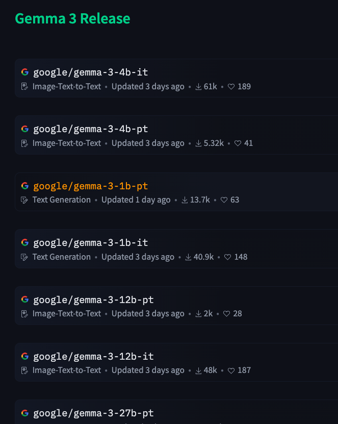
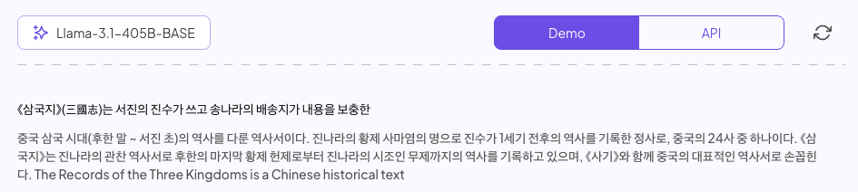
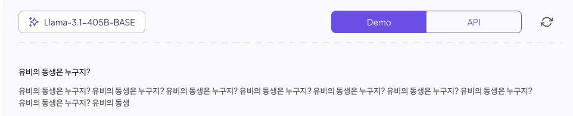
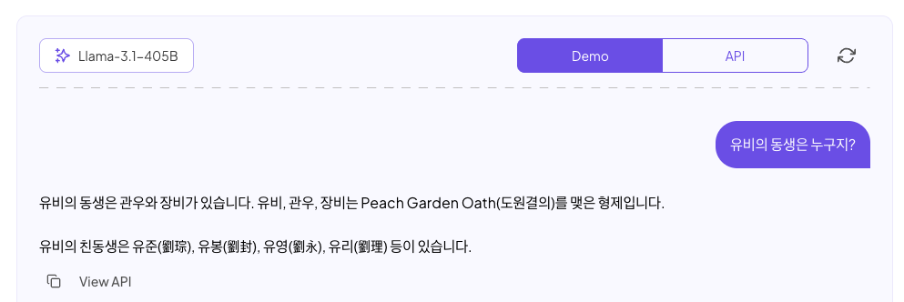
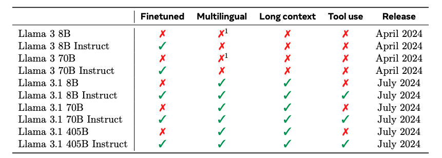

# LLM 모델 유형 및 특징

## LLM Status 에 따른 분류

### Base Model vs Instruct Model

많은 오픈 웨이트 모델들은 Base Model 과 Instruct Model 두 가지 버전으로 제공됩니다. 물론 Instruct Model 만 공개하는 경우도 많습니다.  
아래 그림은 25년 3월 공개된 Gemma3 시리즈의 HuggingFace 페이지 입나다.  
pt (pretrained, base model 임) 버전과 it (instruct, 파인튜닝된 모델 임) 버전이 있습니다.  

  
  
<em>Gemma3 시리즈의 HuggingFace 페이지</em>

현시점 기준으로 많은 한국어 모델들 (Exaone, Kanana, ...) 등은 Base Model 을 공개하지 않고 있어서 아쉽습니다.  

### Base Model
- Base Model 은 pretrained 만 완료된 모델입니다. 그래서 사람처럼 대화하지 못 합니다. 학습단계에서 단순히 수많은 글을 읽었기 떄문에, 어떠한 input도 글의 일부라고 생각합니다.
- 아래와 같이 위키 스타일의 글을 일부 인풋으로 주면 자연스럽게 이어서 작성합니다. 

  
  
<em>Base Model 의 예시 - 희망편</em>

- 반면, 아래와 같이 대화형식으로 질문하면 완전히 망가지는 모습을 보입니다. 

  
  
<em>Base Model 의 예시 - 절망편</em>

- 그렇다면, Base Model은 어디에 써야할까요? 사실상 바로 사용하기는 어렵습니다. 대부분 파인튜닝의 재료로 활용됩니다. 알아서 튜닝해서 가져다 쓰라는 용도라고 볼 수 있습니다.  

### Instruct Model
- 대화 형식으로 튜닝된 모델입니다. 현재 우리가 보통 사용하는 ChatGPT 와 같은 형태는 모두 Instrcut 튜닝이 완료된 모델들 입니다. 
- 위 Base 모델에서 망가졌던 질문을 똑같이 한번 해보겠습니다.
 

  
  
<em>Instruct Model 의 예시</em>

- 대화 형식으로 아주 잘 대답하는 것을 확인 할 수 있습니다. 
- Instruct Model은 대화 형식의 대답 뿐만 아니라, tool use 와 같은 다양한 기능들이 추가되는 것이 일반적입니다.
- 사람으로 비유하자면, 메뉴얼을 다 학습해서 일할 준비가 된 경력직이라고 보면 되겠습니다, 회사들이 메뉴얼을 각각 다르게 만들테니, 모델마다 지원하는 일의 범위가 다를 수 있습니다. 
- Llama 3.1 의 예시를 보면, Instruct 모델이 어떤 기능을 추가로 지원하는지 알 수 있습니다. (자세한 내용은 [Herd of Models](https://arxiv.org/pdf/2407.21783) 페이퍼를 보시면 되겠습니다.)

  
  
<em>Llama 3.1 의 Base Model 과 Instruct Model 의 차이</em>

 

## LLM 용도별 분류

### 대형 언어 모델 (LLM)
- 방대한 텍스트 데이터를 학습해 자연어 생성 및 이해에 특화된 모델입니다, 자세한 설명은 여기서는 안해도 되겠죠?

### 임베딩 모델 (벡터 생성)
- 문장이나 글을 고차원 숫자 벡터 표현으로 변환하여 의미를 파악하고 벡터 검색에 활용되는 모델입니다.
- 텍스트의 의미와 관계를 표현하는 벡터를 생성하여, 유사한 의미의 글들끼리 가까운 벡터로 매핑합니다.
- 특징:
  - 일반적인 LLM보다 경량화가 되어 있고, 훨씬 저렴하고 빠릅니다.   
  - 벡터 데이터베이스와 결합해 대규모 문서 집합에서 의미 기반 검색을 수행합니다, RAG 의 필수적인 단계인 Semantic Search 에 많이 쓰입니다.
  - ex. Cohere 의 Embed 모델이나 OpenAI의 text-embedding-3-* 모델 등이 여기에 속하며, 검색이나 추천 시스템에서 쿼리와 문서의 의미적 유사도를 계산하는 데 쓰입니다.
  - 참고: [Openai Embeddings](https://platform.openai.com/docs/guides/embeddings)

### 멀티모달 모델 (텍스트 + 이미지/음성)
- 텍스트와 이미지, 음성 등 복수의 데이터 형태를 동시에 처리할 수 있는 모델입니다.
- 이미지 캡션 생성, 음성 인식 및 합성, 비디오 이해 등 다양한 modality를 언어와 함께 다룹니다.
- ex.
    - LLaVA: Vision Encoder를 LLM 에 결합해 이미지를 이해하고 설명하는 오픈소스 챗봇 모델로, 텍스트-이미지 조합 지시에도 응답할 수 있습니다.
    - OpenAI의 GPT-4o: 텍스트 뿐만 아니라 이미지 입력을 받아 처리할 수 있고, 음성은 In/Out이 모두 됩니다, o1 도 이미지 인풋이 가능합니다. 
    - 구글의 Gemini: 텍스트, 이미지, 오디오, 비디오 까지 다양한 입력을 처리할 수 있습니다.

### 추론 특화 모델 (Reasoning Model)
- 복잡한 문제 해결과 논리적 추론에 중점을 둔 LLM들입니다.
- LLM에 Chain-of-Thought 와 비슷한 형식의 reasnong 추론을 하도록 만든 모델입니다. 만드는 방법에 대해서는 뒤에서 설명합니다.
- 특징:
  - 수학 계산, 퍼즐 풀이, 복잡한 의사결정 등 오랜 사색이 필요한 태스크에 강점이 있습니다.
  - 생각을 오래하기 떄문에 많이 느립니다.
  - Ex. 
    - OpenAI의 o1, o3: 복잡한 추론 작업에서 GPT-4, GPT-4.5보다 월등한 성능을 보입니다.
    - Anthropic의 Claude-3.7-sonent-thinking, Google의 Gemini 2.0 Flash Thinking
    - DeepSeek-R1, Alibaba의 QWQ, ... 많이 있습니다.

### 기타 특수 모델 (Diffusion LLM, VLA 등)
- 특수 목적으로 설계된 변형 LLM 유형들도 등장하고 있습니다.
- 유형:
    - **Diffusion LLM**: 이미지 생성에 사용되던 확산 모델(diffusion) 개념을 텍스트 생성에 적용한 새로운 유형으로, Auto Regressive 방식의 한계를 극복하려는 시도입니다.
        - ex. Inception Labs의 Mercury Coder는 세계 최초 상용 규모 확산 LLM으로, 기존 모델보다 5~10배 빠른 초당 1000 토큰 이상의 생성 속도를 실현했다고 발표되었습니다.
    - **VLA(Vision-Language-Action) 모델**: 로봇 제어를 목표로 시각과 언어 정보를 행동 지시로 변환하는 모델입니다.
       - ex. Physical Intelligence의 Pi0, FigureAI의 Helix
    - **코드 생성 전용 LLM**: 프로그래밍 코드 생성에 특화된 모델입니다.

## 오픈 웨이트 모델과 상업용 모델

### 주요 공개 LLM (글로벌)

- Meta의 **LLaMA**: 메타 AI가 공개한 대규모 언어 모델 시리즈입니다.
    - 최신 버전인 LLaMA 3.3은 2024년 9월 출시, 3.X 버전에는 1b 부터 405b 까지 다양하게 있습니다. [^1]
    - "The Llama 3 Herd of Models" 논문을 공개해서 LLaMA 3 시리즈의 다양한 모델들과 그 특성을 상세히 설명합니다, 그런데 데이터는 공개 안했습니다. [^2]
    - LLaMA 3.3은 여러 벤치마크에서 GPT-4o, Claude 3.5 Sonnet과 경쟁하는 수준입니다. deepseek 발표 전까지는 오픈 웨이트 모델의 희망이었죠. [^3]
    - 라이선스: LLaMA 3.3은 연구 목적으로 자유롭게 사용 가능하며, 상업적 용도는 제한이 있습니다 (8B 모델은 월 7000만 사용자 이하 서비스에 허용).[^4]

- **Mistral AI**: 프랑스의 AI 스타트업이 개발한 고성능 오픈 소스 모델 시리즈입니다.
    - **Mistral 7B**: 2023년 출시된 7B 모델로, 효율성과 성능의 새로운 기준을 제시했습니다.[^5]
    - **Mixtral 8x7B**, **Mixtral 8x22B**: 2023, 2024년 출시된 MoE 아키텍처 기반 모델로, 560억 파라미터 모델과 동등한 성능을 보이면서 추론 비용은 저렴합니다.[^6]
    - **Mistral Large 2**: 2024년 7월 출시된 123B 모델로 GPT-4o 수준의 성능을 제공합니다, 인기는 그닥  인것 같아요. [^7]
    - 라이선스: Apache 2.0 라이선스(7B 및 8x7B 모델)로 연구 및 상업적 활용이 자유롭게 가능합니다.

- **DeepSeek**:
    - **DeepSeek-V3**: 2024년 12월 발표된 MoE 구조의 최신 모델로 총 6710억 파라미터 전문가 모듈을 포함하며 질의당 약 370억 파라미터만 활성화됩니다.[^8]
    - **DeepSeek-R1**: 추론 특화 모델로 심층적 사고를 요하는 문제에 효과적인 성능을 보입니다. 2024년 10월 업데이트된 버전은 수학 및 복잡한 추론 작업에서 더욱 향상된 성능을 보입니다.[^9]
    - 라이선스: 대부분 모델이 Apache 2.0 라이선스로 상업적 이용이 자유롭습니다.

- HuggingFace **Zephyr**: Hugging Face 주도로 발표된 오픈소스 대화형 챗봇 계열 모델입니다.
    - 7B 파라미터 모델(Zephyr-7B-β)이 공개되어 있으며, Mistral-7B를 기반으로 합니다.[^10]
    - 직접 선호 최적화(Direct Preference Optimization, DPO) 기술을 활용해 사용자 지시 따라가기 능력을 향상시켰습니다.[^11]
    - 2023년 10월 출시 당시 오픈소스 모델 중 좋은 성능을 보였고, 지금도 계속 연구중입니다. 최근엔 ORPO 를 적용한 모델이 나왔네요.  
    - 왜 여기에 넣었나면요, 학습 데이터(UltraFeedback)를 투명하게 공개했습니다. [^12]
    - 라이선스: MIT 라이선스로 제공되어 학술 및 상업적 용도로 자유롭게 활용 가능합니다.

- Cohere **Aya Expanse**:
    - **Aya**: 2024년 공개된 다국어 특화 오픈 LLM으로, 다국어 지원을 잘 하는 것을 목표로 합니다. 실제로 제 체감 성능상 한국어를 정말 잘 합니다. [^13]
    - 24년 말 SK 그룹에서 진행된 파인튜닝 강의 (본 자료를 활용했음) 에서, 30B 이하 수준 모델들 중 가장 좋은 한국어 성능을 보였었습니다. 
    - 참고로 Cohere 는 LLM 보다도 임베딩 모델이나 특히 Rerank 모델로 유명합니다. 저도 개인적으로 만든 서비스에 Cohere Reranker 를 사용합니다. 

- 알리바바 **Qwen**: 알리바바의 통용언어인공지능기술연구원(DAMO Academy)이 개발한 다국어 모델입니다.[^14]
    - **Qwen2.5**: 2024년 8월 출시된 최신 버전으로 0.5B부터 72B까지 다양한 크기로 제공됩니다.
    - **Qwen2.5-VL**: 비전-언어 멀티모달 모델로 이미지 이해 및 분석 능력이 뛰어납니다.
    - **Qwen-Coder**: 코딩에 특화된 모델로 다양한 프로그래밍 언어 지원 및 높은 코드 품질을 제공합니다.
    - **QWQ**: 2024년 9월 출시된 추론 특화 모델로 복잡한 문제 해결 능력이 강화되었습니다.
    - 특히 중국어와 영어에 강점이 있으며, 7B 모델도 GPT-3.5 수준의 성능을 보여줍니다.
    - 라이선스: Qwen2.5 모델들은 오픈소스(Tongyi Qianwen License)로 제공되어 상업적 이용도 가능합니다.

- 마이크로소프트 **Phi**: 마이크로소프트가 개발한 소형 고효율 모델 시리즈입니다.[^15]
    - **Phi-4**: 2024년 12월 출시된 최신 버전으로 4B(Mini), 14B 크기로 제공됩니다.[^16]
    - **Phi-4 Multimodal**: 텍스트와 이미지를 함께 처리할 수 있는 멀티모달 모델입니다.
    - 라이선스: MIT 라이선스로 연구 및 상업적 목적 모두에 자유롭게 사용 가능합니다.

- 기타 **Yi-V2**, **KIMI** 등 다양한 모델들이 많이 있습니다. [^17]
 

### 한국어 특화 공개 모델

- LG AI Research **Exaone**: LG AI연구원이 개발한 한국어/영어 모델입니다. [^18]
    - 2024년 Exaone 3.5 버전을 오픈 웨이트로 공개되었고요, 평이 꽤 좋습니다. 
    - 2.4B, 7.8B, 32B 3가지 버전으로 제공되며, 최대 100페이지 분량의 긴 문서도 한 번에 처리합니다.

- 업스테이지 **SOLAR**: 업스테이지가 개발한 한국 스타트업 최초(?)의 글로벌 경쟁력이 있는 모델입니다. [^19]
    - 2023년 8월 라마2 70B를 기반으로 한 SOLAR 70B를 공개해 HuggingFace Open LLM Leaderboard 1위를 기록했습니다.
    - 2023년 12월에는 자체 개발한 SOLAR 10.7B를 공개해 다시 한 번 오픈소스 LLM 세계 1위에 올랐습니다.
        - Benchmark 순위에 대한 효용은 논란의 여지가 있지만, 어쨌든 1등을 했고 꽤 뛰어난 건 이견의 여지가 없는 것 같아요.
    - 2024년 말에는 pro preview 가 나왔는데, (2025년 3월 작성일 기준) 곧 나올 것인가 봅니다.  

- 카카오 **Kanana**: 카카오가 2024년 공개한 한국어-영어 이중언어 LLM 시리즈입니다. [^20]
    - 낮은 계산 비용으로 한국어에서 최고 성능을 내는 것을 목표로 합니다.
    - 고품질 데이터 선별, 계단식 사전학습, Depth up-scaling, 가지치기 및 증류 등의 기법으로 효율성과 성능을 모두 달성했습니다.
    - 저 개인적으로는 개발기를 꽤나 자세하게 잘 공개해서 보기 참 좋았고, 인상 깊었습니다. 따라해보고 싶더라고요.  [^22]

### 상업용 모델

- OpenAI **GPT, o1 시리즈**: OpenAI의 대표적인 상업용 LLM 군으로, 현재 가장 널리 쓰이는 ChatGPT의 기반입니다.
    - GPT-3.5(Turbo)는 1750억 파라미터급 모델로 대화형 AI에 활용됩니다.
    - GPT-4는 멀티모달 입력(이미지+텍스트)을 처리하고 출력할 수 있으며, 사례 기반 추론 능력과 사실적 응답 면에서 GPT-3.5 대비 크게 향상되었습니다.
    - 모의 사법시험(bar exam)에서 GPT-4는 상위 10% 수준 점수로 합격권에 든 반면, GPT-3.5는 하위 10%에 그쳤습니다.
    - 폐쇄형 모델로서 OpenAI API나 ChatGPT 서비스를 통해서만 접근 가능합니다.

- Google **Gemini 시리즈**: Google DeepMind가 2023년 발표한 최신 거대 모델 시리즈입니다.
    - Ultra, Pro, Nano의 3가지 크기로 최적화되어 제공됩니다.
    - Ultra는 가장 크고 복잡한 작업용, Pro는 범용 목적용, Nano는 모바일 기기에서도 동작 가능한 효율 모델입니다.
    - 대규모 이미지/영상 이해와 수학 문제 풀이에서 Gemini Ultra가 기존 SOTA를 넘어서는 성능을 입증했습니다.
    - Gemini 는 오픈 버전 Gemma 를 포함해서  Gemini 2.0 Flash, Gemini 2.0 Flash Thinking 등 다양한 모델들이 있습니다.
    - 또한 구글 딥마인드에는 AlphaGeometry, AlphaProof, AlphaFold 등 다양한 특수 모델들이 있습니다.

- Anthropic **Claude 시리즈**: OpenAI 출신들이 설립한 Anthropic이 개발한 LLM 시리즈입니다. [^21]
    - 창의적 글쓰기, 코딩, 복잡한 질의 응답에서 GPT 시리즈에 준하는 성능을 목표로 합니다.
    - Claude 3.7 sonnet 이 2025년 2월 출시되었고, thinking 버전을 포함합니다.
    - 개발자 분들은 GPT 보다 Claude 를 선호하는 경향이 있습니다. 저도 그렇고, 개인적인 평으로는 확실히 코드를 더 잘 짜는 것 같습니다. 

[^1]: Meta AI. (2024). "LLaMA 3.3". [Meta](https://www.llama.com/docs/model-cards-and-prompt-formats/)
[^2]: Meta AI. (2024). "The Llama 3 Herd of Models". [arXiv:2407.21783](https://arxiv.org/abs/2407.21783)
[^3]: Meta AI. (2024). "LLaMA 3.3 Performance Benchmarks". [Meta AI](https://ai.meta.com/llama/performance/)
[^4]: Meta AI. (2024). "LLaMA 3.3 License". [Meta AI](https://llama.meta.com/llama3/license/)
[^5]: Mistral AI. (2023). "Mistral 7B". [Mistral AI Blog](https://mistral.ai/news/announcing-mistral-7b/)
[^6]: Mistral AI. (2024). "Mixtral of Experts". [Mistral AI Blog](https://mistral.ai/news/mixtral-8x22b)
[^7]: Mistral AI. (2024). "Mistral Large 2". [Mistral AI Blog](https://mistral.ai/news/mistral-large-2/)
[^8]: DeepSeek. (2024). "DeepSeek-V3". [DeepSeek github](https://github.com/deepseek-ai/DeepSeek-V3)
[^9]: DeepSeek. (2024). "DeepSeek-R1". [DeepSeek github](https://github.com/deepseek-ai/DeepSeek-R1)
[^10]: HuggingFace. (2023). "Zephyr-7B-β". [HuggingFace Models](https://huggingface.co/HuggingFaceH4/zephyr-7b-beta)
[^11]: Tunstall, L. et al. (2023). "Zephyr: Direct Distillation of LM Alignment". [arXiv:2310.16944](https://arxiv.org/abs/2310.16944)
[^12]: HuggingFace. (2023). "UltraFeedback Dataset". [HuggingFace Datasets](https://huggingface.co/datasets/openbmb/UltraFeedback)
[^13]: Cohere For AI. (2024). "Introducing Aya". [Cohere For AI Blog](https://cohere.com/research/aya)
[^14]: Alibaba DAMO Academy. (2024). "Qwen2.5". [GitHub](https://github.com/QwenLM/Qwen2.5)
[^15]: Microsoft. (2024). "Phi Series". [Microsoft Research](https://www.microsoft.com/en-us/research/blog/phi-2-the-surprising-power-of-small-language-models/)
[^16]: Microsoft. (2024). "Introducing Phi-4". [Microsoft HuggingFace](https://huggingface.co/microsoft/phi-4)
[^17]: 01.AI. (2024). "Yi-V2". [GitHub](https://github.com/01-ai/Yi)
[^18]: LG AI Research. (2024). "EXAONE-3.5". [GitHub](https://github.com/LG-AI-EXAONE/EXAONE-3.5)
[^19]: Upstage. (2023). "SOLAR 10.7B Emerges as World's Top Pre-trained LLM". [Upstage News](https://www.upstage.ai/news/solar-10-7b-emerges-as-worlds-top-pre-trained-llm)
[^20]: Kakao. (2024). "Kanana". [GitHub](https://github.com/kakao/kanana)
[^21]: Anthropic. (2024). "Claude 3.7 Sonnet". [Anthropic News](https://www.anthropic.com/news/claude-3-7-sonnet)
[^22]: Kakao. (2024). "Kanana". [Kakao Tech](https://tech.kakao.com/posts/661)