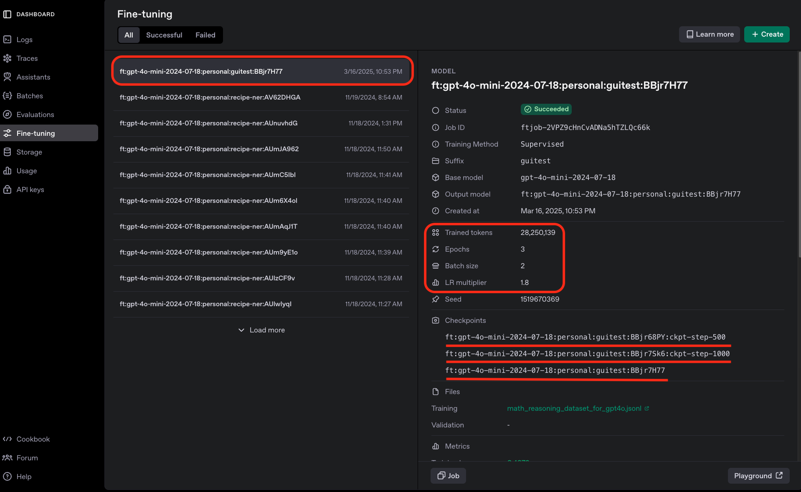
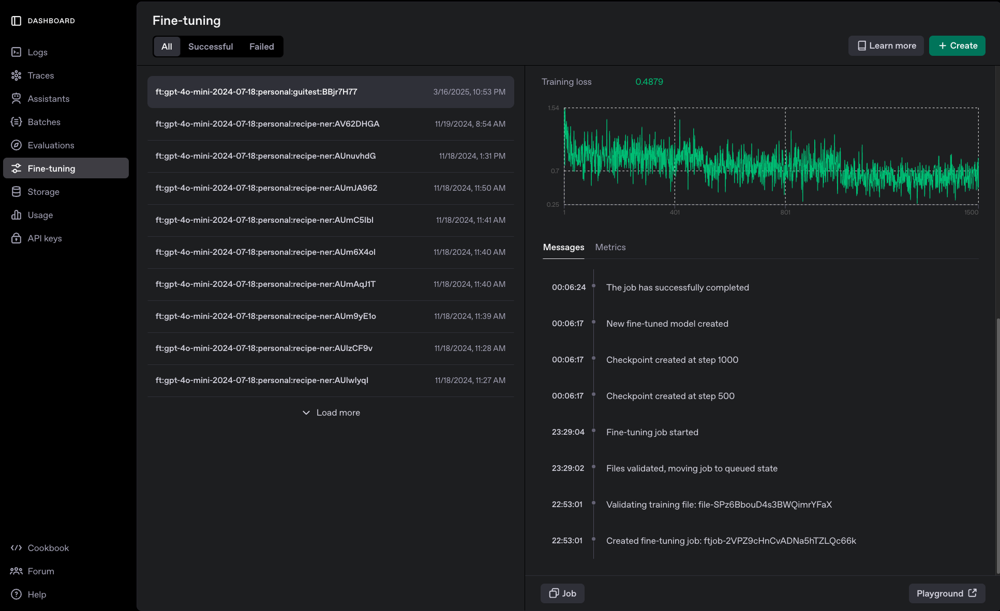
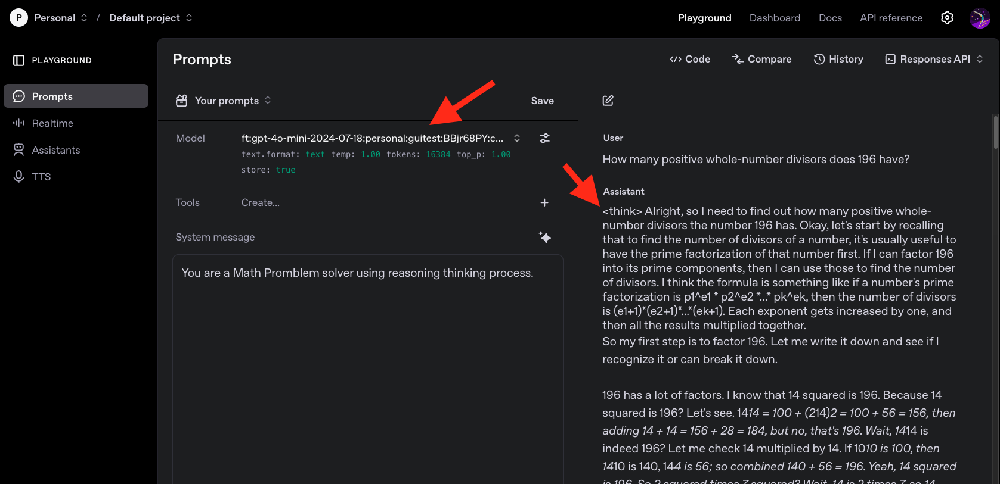

# OpenAI GPT 모델 파인튜닝 (GUI)

OpenAI 는 GPT 모델들의 Fine Tuning 기능을 지원합니다. 그런데, 어느 순간 GUI 만으로도 가능해졌네요!  
필자도 25년 3월 기준 확인해보니 생겨있어서 사용해보고 소개합니다.  


## OpenAI Fine-Tuning Job 생성 

먼저 [OpenAI 파인튜닝 대시보드](https://platform.openai.com/finetune)에 접속합니다. 

<div style="text-align: center;">
  
</div>


우측 상단에 Create 버튼을 눌러 시작할 수 있습니다. Fine Tuning 은 오래 걸리기 떄문에 "Job" 으로 생성이 됩니다.  
데이터 올려주고, 모델 선택하고, 파라미터 설정하고 시작하면 됩니다.

학습 데이터는 제가 생성한 [reasoning 데이터](https://github.com/jonhpark7966/FineTuning_Course/blob/main/docs/practice_guides/data/math_reasoning_dataset_for_gpt4o.jsonl)를 사용해보셔도 좋습니다. 다운받아서 올려보세요.  
직접 각자 원하시는 데이터를 준비하셔서 넣어보셔도 좋습니다.  


<div style="text-align: center;">
  
</div>

파라미터는 기본이 설정을 안하는 것을 추천드리고요, 알아서 설정이 됩니다.  
Validation Data 도 올려두면, 중간중간 valid 성능을 볼 수 있습니다. 아마 ML 이나 LLM 이전의 Deep Learning이 익숙하신 분들은 Validation이 당연히 필요하다고 생각하실 수도 있습니다만, LLM은 next token prediction 의 loss 를 보는 것이라 꼭 필요한 것은 아닙니다. (당연히 데이터가 충분하면 사용하면 좋습니다.)


## Fine Tuning 결과 확인

Create 를 하시면 Job 이 생성되고 기다리시면 됩니다.  
완료가 되면 아래와 같이 완료 알림 메일이 옵니다. 알림이 오니까 편하네요. 

<div style="text-align: center;">
  
</div>

학습 결과를 한번 보겠습니다. 
Job 을 클릭하면 우측에 정보가 스크롤되어 나옵니다.  

- Hyperparameters 는 default 값으로 설정했는데, 3 epoch 에 batch size 2 로 진행이 되었네요.
- 총 28M 토큰이 학습되었습니다. 1M 토큰당 3 USD 가 발생하니 총 84 USD 가 발생합니다. 본 데이터는 비용이 많이 드는 편입니다. 
- 500 step 마다 Checkpoint 가 생성되었습니다. CheckPoint 는 중간 중간 저장된 모델이므로 모두 사용이 가능합니다.  

<div style="text-align: center;">
  
</div>


스크롤을 내려서 학습 과정을 더 보겠습니다.  
Training Loss 를 step 별로 관찰이 가능합니다. (validation data 를 넣으면 validation loss 도 볼 수 있습니다.)

- 1000개의 대화 데이터기 때문에 batch size 2 로 총 1500 step 입니다.  
- 학습 시간은 1시간 15분 정도 걸렸네요.  


<div style="text-align: center;">
  
</div>


## Fine Tuning 된 모델 사용해보기

Playground 에 가서 테스트를 한번 해보겠습니다. 어떤 변화가 생겼을지 확인을 해봅시다.  
우선 제가 학습시킨 데이터를 한번 보겠습니다.  

### 학습 데이터 열람

Stanford 연구진이 DeepSeek-R1 모델을 이용해서 만든 [reasoning 데이터](https://huggingface.co/datasets/simplescaling/s1K-1.1) 를 가공한 데이터 입니다.  
하나의 데이터 예시를 보겠습니다. 

```jsonl
{"messages": [
  {"content": "You are a Math Promblem solver using reasoning thinking process.",
   "role": "system"},
  {"content": "Given a rational number, write it as a fraction in lowest terms and calculate the product of the resulting numerator and denominator. For how many rational numbers between 0 and 1 will $20_{}^{}!$ be the resulting product?",
   "role": "user"},
  {"content": "<think>\nAlright, so I need to figure out how many rational numbers between ... However, a different way to phrase this is: a is numerator and b is denominator in </think>
               Given a rational number between 0 and 1, we need to write  ...  the product of the numerator and denominator in lowest terms is \\(20!\\) is \\(\\boxed{128}\\).",
   "role": "assistant"}]} 
```

중간 과정은 너무 길어서 생략을 했습니다. 수학 문제가 있고요, LLM은 < think > 태그를 이용해서 풀이 과정을 적고, 그 다음 대답을 합니다.  
DeepSeek-R1 모델이 이런식으로 동작합니다. Reasoning 과정을 거치고 대답을 하죠.  
이 Reasoning 데이터를 훈련 시켜서 튜닝한 gpt-4o-mini 모델도 이제 비슷하게 대답을 하게 되겠죠. 


### 파인튜닝된 모델 테스트

[OpenAI Playground](https://platform.openai.com/playground) 에 접속하면, 직접 튜닝한 모델을 테스트해볼 수 있습니다, 당연히 API 로도 호출해서 사용이 가능합니다.  

<div style="text-align: center;">
  
</div>

모델을 직접 학습한 모델로 선택을 해주고, 학습 데이터와 같은 형식으로 system prompt 를 작성해 줬습니다.   
> "You are a Math Promblem solver using reasoning thinking process."  

그리고 수작문제를 하나 물어봤더니 위 캡쳐와 같이 대답을 하네요.  

- 첫째로 < think > 태그를 이용해서 풀이 과정을 적고, 그 다음 대답을 합니다.  
- 둘째로 파인 튜닝 이전 상태인 gpt-4o-mini 모델과 비교해서 "매우" 길게 풀이를 쓰고 답변을 했습니다. 


<details>
  <summary>Fine Tuned gpt-4o-mini 의 답변</summary>

< think > Alright, so I need to find out how many positive whole-number divisors the number 196 has. Okay, let's start by recalling that to find the number of divisors of a number, it's usually useful to have the prime factorization of that number first. If I can factor 196 into its prime components, then I can use those to find the number of divisors. I think the formula is something like if a number's prime factorization is p1^e1 * p2^e2 *...* pk^ek, then the number of divisors is (e1+1)*(e2+1)*...*(ek+1). Each exponent gets increased by one, and then all the results multiplied together.
So my first step is to factor 196. Let me write it down and see if I recognize it or can break it down.

196 has a lot of factors. I know that 14 squared is 196. Because 14 squared is 196? Let's see. 1414 = 100 + (214)2 = 100 + 56 = 156, then adding 14 + 14 = 156 + 28 = 184, but no, that's 196. Wait, 1414 is indeed 196? Let me check 14 multiplied by 14. If 1010 is 100, then 1410 is 140, 144 is 56; so combined 140 + 56 = 196. Yeah, 14 squared is 196. So 2 squared times 7 squared? Wait, 14 is 2 times 7, so 14 squared is (27) squared, which is 449, so 196 is also 2 squared times 7 squared? Yes! So 196 factors into 2^2 * 7^2. Let me check: 2^2 is 4, 7^2 is 49, and 449 is 196. Yep, exactly.

So prime factorization: 2^2 * 7^2. Then, using that exponent rule for the number of divisors, we add 1 to each exponent and multiply. So each exponent is 2, so adding 1 gives 3, so 3 * 3 = 9. Therefore, the number of divisors is 9.

But let me verify that. The divisors are all possible combinations of multiplying 2's and 7's, right? So the divisors would be 2^07^0=1, 2^17^0=2, 2^27^0=4, 2^07^1=7, 2^17^1=14, 2^27^1=28, 2^07^2=49, 2^17^2=98, 2^2*7^2=196. Which gives 9 divisors.

So that makes sense. Each exponent increased by one. Maybe my reasoning is right, but I should see if I can double-check other methods. Let's do that.

Alternatively, maybe 196 isn't (2^2 * 7^2)? Let me check starting from 196. Let's list its divisors manually to see how many there are. It can't be that many, because it's 196, which isn't too huge, so maybe divisors are up to 196. Wait, how many divisors? Let's count them with the method of listing:

1: 196 ÷ 1 = 196, so (1, 196). Yes!
2: 196 ÷ 2 = 98, so (2,98). Yes!
3: 196 ÷ 3 = 65.33, not integer. So 3 is not a divisor.
4: 196 ÷ 4 = 49, so (4,49) yes.
5: 196 ÷5=39.2, not integer.
6:19÷6=32.6667, not integer.
7:196 ÷7=28, so (7,28) yes.
8:196 ÷8=24.5, not integer.
9:196÷9=21.777, not integer.
10: 196÷10=19.6, not integer.
11:196÷11=17.818, not integer.
12:196÷12= 16.3333 not integer.
13:196:13=15.0769, not integer.
14:196:14=14, so pairs (14, 14) yes.
15:196:15=13.0667, not integer.
16:196:16=12.25, not integer.
17:196/17=11.529, not integer.
18:196:18=10.8889, not integer.
19:196:19=10.3158, not integer.
20:196/20=9.8, not integer.
21:196/21=9.3333, not integer.
22:196/22=8.9091, not integer.
23:196/23=8.5217, not integer.
24:196/24=8.16667, not integer.
25:196/25=7.84, not integer.
26:196/26=7.5385, not integer.
27:196/27=7.2593, not integer.
28:196/28=7, pair (28,7) yes.
29:196/29=6.75862, not integer.
30:196/30=6.5333... not integer.
31:196/31=6.32258 not integer.
32:196/32≈6.125, decimal, not integer.
33:196/33=5.9394..., not integer.
34:196/34≈5.7647, not integer.
35:196/35≈5.6, not integer.
36:196/36≈5.4444, not integer.
37:196/37≈5.2973, not integer.
38:196/38≈5.1579, not integer.
39:196/39≈5.02564, not integer.
40 - 49, (since 196/40=4.9,196/49=4,49 same). Wait, 40-49. So let's consider 40-50:

40: 196/40=4.9, not integer.
41:196/41≈4.8049, not integer.
42:196/42≈4.666..., not integer.
43:196/43≈4.5588, not integer.
44:196/44≈4.4545, not integer.
45:196/45≈4.3556, not integer.
46:196/46≈4.2609, not integer.
47:196/47≈4.1702, not integer.
48:196/48=4.0833..., not integer.
196/49=4,pair (49,4) yes.

Wait, 196=2^2 7^2, right? So 196 factors as (2x2)(7x7)? Wait, misthinking. Let's try again. So factors up to square root(196)=square root of 196, which is 14, so count up to 14.

So this gives: divisors 1,2,4,7,14, negating lower factors? Wait, maybe that's not the right thought. Wait, sorry. 196 is a perfect square. Wait, wait, maybe missed some? Wait, if the number is a perfect square, its divisors can be paired as fd=d*f, so when I reached square root, say e.g., if number is 36, divisors would be ... the middle number is only counted once. So if 196 is 14 squared, maybe 14 isn't on there? Wait, but wait. For n=1,...sqrt(n), factors are n/d. Wait, wait confusion on duplicates. So for example, if factors are 1,2,3,4,6,12,153,204 made through maybe. Let's list factors:

Compute all divisors: for each d up to 14, 196 ÷ d gives integer? Count distinct? Hmm.

Wait divisor test involves running up to square-root(n). For 196, sqrt(196)=14. So if I do test d <=14, divisors 1,196,2,98,4,49,7,28,14,14. The divisors starting from small factor 1 up to sqrt(n). So pairs (1,196), since reversing too, but combining overlap? Wait, then distinct numbers. Wait, but in listing [1,2,4,7,14,28,49,98,196].

So divisors: different multiples of prime factors? Because prime factorization gives 2^2 *7^2, so which gives (2+1)(2+1) = 9. Which agrees with counting pairs. So in listing [1,2,4,7,14,28,49,98,196] indeed are 9 divisors. So count of divisors as e1+1 * e2+1? Let's check:

We have 2^2 7^2, the coefficients are 33=9? Wait, when doing the prime factorization method, we have 1 factorization of 2,2, so 2 exponents plus something we call factors, so...

Wait, formula number of divisors as product of (ei +1) , where e=exponents in prime factorization. For example 196=2^27^2, so each has exponents 2, therefore number of divisors is (2+1)(2+1) =9. Each exponent (2,2) becoming (3,3) ? Wait yeah because formula for the number of divisors is ( (e-1 + 1)(f-1 +1 ) ) i.e. product of (exponent +1). Wait, these exponents in formula, so in our case, 196=2^27^2, exponents 2,2. Therefore, (2+1)(2+1)=33=9. So number of divisors equals nine.

So perhaps, listing by hand matches this number which is 9, as in for any non-negative product becomes. Wait, we can check that.

Thus, my initial thought of listing divisors manually confirmed: 9 divisors, indeed. So prime factorization method seems working. Maybe that is enough to conclude but perhaps I can check an alternative method.

Another method to calculate number of divisors. So after prime factorization, doable. Alternatively, trial division, but maybe to see if there is a different way? Let me think.

Suppose, for example, factor each number from 1 to 196. But that's impractical as 1 to 196 is a huge list. Alternatively, note 196 is 14^2, which is squared, so divisors always come in pairs. If we pair divisors that multiply to the number, unless it's a square? Wait 14 isn't a divisor, but wait, 14 is sqrt 196, right, holding that value.

So maybe for perfect square 196, although 14 is counted, so sqrt divisor is 14, leading to unpaired? Wait, no when calculating divisors. Wait, another way to see is that each divisor d <= sqrt(196) =14 must pair with another d' >= sqrt(196). Unless that divisor is sqrt(n), in which case sqrt(n) pairs with itself. So leading to divisor being n= sqrt(n)=14. Thus, for 196, different from non-square number?

Alternatively, by knowing 196 is a square, can even state that the core idea is that perfect squares will always have an odd number of divisors. An interesting. Hmm. For example, for any number x, the number of divisors formula would be odd number when x is a perfect square; because would have (an even exponent) plus one? Wait, let's consider when (ei +1)*(ej +1) where either i or j can be zero. Wait for the divisor count for the number n. If all exponents in its prime power increasing, then the divisors look like above proof.

Alternatively for a number n, defined as product over primes p of (x), but relevant to since number can be written as product. Wait, number of divisors d(n) is product of (exponents +1). By prime factorization. So that product is equal to product over primes p of (f +1). Where f is exponent of prime p in factorization.

An alternative way could be combinatorial when thinking of ordered unique triples when n is a cube? Wait, though square is not a cube in gen; but suggests geometric family for figures? Not sure applicable.

Alternatively consider pyramid or cube structure for special divisors. But for general number of divisors is formula derived from prime factorization.

Wait but how do I know two different decompositions? Maybe prime number power products; that's the standard uniqueness.

Wait, suppose 100= 2^25^20*0, then 100 has factors depending on including 3? However in standard prime factor formula, primecomponent check for hundred is primes.

But wait, 100 does not have 3 or 7; but perhaps explains?

Wait in general, but in the factorization step, all numbers can be factored into primes. For example, every prime number p can only be in (p^1), and composites can map to product terms.

Wait, suppose if infinity exponents, number infinity? However, mathematical questions involving primes and intermediate values.

But for finite numbers as in question posed, then would remain that prime factorization is unique for all composite numbers in AZ.

Therefore, answer remains 9 as having arrived previously through prime factorization. Understood. Alternatively, procedures whether for perfect number or not.

Wait, even though to reiterate, when factorization of n as p1^b1... arises. Then there is no other factorization differing through permutations; as prime factorization is unique upto order unless with non-prime components. However, considered inconsistent? Wait no, if there is different factorization, then factors with Hamiltonian. Wait, I need to be careful.

Wait, no: for example, 4 can be written as (2*2)^1, but cannot be written differently. Hence 4 is indeed only factorizable as (2^1 *2^1 *, not divisor rules. Wait for example, if I had 1,2, then 2 is divisor. Wait confusing. Wait the unique composing primes is from unique. Wait actually, prime decomposition association. Wait, actually I must be careful. Here it's:

Wait, the prime factorization is unique even allowing for 1, since (1) is multiplicative. So for example 14=114 or 72, I'd think non-uniqueness. Wait but 14 primes are 2*7. Hence there are multiple factorizations for any composite number. Therefore, how could permutation of exponents, but we don't care. Wait, hold on.

Wait no: In standard prime factorization, every composite number can be written as product of primes with coefficients greater than one. For example 18=29=23^2. So to correspond to a prime exercise, since prime elements, then each prime raised to its power. For example, unique prime power decomposition.

So for 14, the unique prime factorization is 2 power and 7. So 14 can be expressed as nn is? Not relevant, but rather how are the cubes? Wait, hence, there exist alternative decompositions. For example, 4 can be divided as 22 or 4*1? Wait.

Wait, but examples:

14=27; unique factorization. 16=2^4, which can be written as 16=28=4*4, etc.

Which when taken are prime generators. However, 14 is written as 14=7*2. If you multiply 14 by 1, etc.

Alternatively, think that factors when written as product; so given all possible exponents can be permuted.

Wait suppose 196= 2^2*7^2; however if I am told that there are other primes? Wait, in which case, but conflicting? Or rather in this case, could there be alternate factorizations? But perhaps, if the result is unique. However, prime factorizations can have finite variations. For example, multiplicative inverse.

Wait if in the standard theory of number theory? Wait, in classical terms, prime factorization is unique. However, to put a note, primes are only integers?

Hmmm.

Alternatively, suppose that for example composite 16=2^4; which could be expressed in different way: 441, etc. Not sure this matters. Wait maybe there is some confusion.

Wait, for example, is the prime factorization one-to-one? For that prime decomposition allows probability of different permutations.

Thus, in count prime factors (or their exponents). Wait, let's see: for example consider numbers such as 142. I guess this is different from sqrt(196)sqrt(196), since sqrt(196)=14; hence 1414=196. Alternatively, "exponents" for the count. So uniqueness up to isomorphism is what they call. However, I am not sure if there are different permutation.

But perhaps since ultimately through prime factorization, the multiplications give rise to permuted orders, but when it comes to counting exponents, they are different order. So in this sense, prime factorizations are unique, except maybe inversibility. For example, if in that direction, 14=114 or 72; so alternate? But hold on.

In general, 14 can be expressed as 27 or 72. So even reversing gives no new factors. But, but at the end, when previous method involved listing divisors starting from 1, so perhaps there's no trimness here when 196=2^2*7^2, the active pairings.

Maybe here's an inconsistency. Wait conflicting with initial divisor count, perhaps. Let me first confirm the number of divisors. Suppose 196, primes 2 and 7, squares.

But 196 is 2 squared *7 squared. The divizione is multiplicative, so need to do trial for each prime the same. But actually even key point even if 196 has a different factor.

Wait, but actually, if given since in earlier methods, primes could be more. Wait, let's think. For example 196 can also be written as 14^2, which still decomposes into 2*7, etc.

Wait but since primes are (unique) as understood, so it's primary unique. So perhaps 196=2^273? Not possible, because then 2^27^2; factored.

Wait, how could 196 be written analogously? Suppose put as 196 =449. So 449=2^2*7^2. Therefore, any factors involve permutations?

Alternatively, could write it as conversion 4*7^2; because, but wait since primes involved, any permutation of prime exponents leads to exponent adjustment. Wait, that becomes.

But given 196 regular prime factorization factors only once. So 196 is =449=2^27^2; but there's no need for another.

But to put the exponent factors and their arrangements? Like, their exponents are (2^,7^). Therefore, (2^,7^), but if overlapping? Wait, but prime factorization 214. Wait, 14 itself as 27. So 14 is a prime product of 2 and 7. Therefore prime factorization repliact but perhaps this is confusing.

Therefore, confusion arises because that the standard way that prime factorization would render non-trivial useful. However, leading to a contradiction? Wait, but no: So 196 can be decomposed into products in different order.

Hence, 196 prime factors are not ordered, hence same prime factors can be different permutations? But in that case, the above counting would be invalid. Wait perhaps, if I end? If so, than suggest, wait let me contemplace.

So perhaps, moving back to divisor counting gone with, 1,2,4,7,14,28,49,98,196, which count 9 distinct divisors. So this is correct, however it is possible even with primes 2 and 7. But but confusion: 196 can also be written as 7214, but still 14 is 2*7. Wait, so even my divisor count lists 1,2,4,7,14,28,49,98,196. Which includes exponents for primes factors, but 14 is square, thus when listing reached 9. Perhaps in standard method, if when going up to sqrt(196)=14, then considering other divisors up to 100. But in case to use different factors, might not fit.

Wait, when 1 was written as divisor because 196 divided by 1 gives 1? Wait, but 196/1=196; even reversed, 1 into any divisor. Hmm not clear? Wait if misapprehension here. Wait, 196 divided by numbers larger than 1 up to sqrt(196), so my thought is that the divisors are up to sqrt(number), but perhaps missteps? Wait I need to redo divisor reasoning.

Wait think about division. So when writing all divisors, 1,2,4,7,14,28,49,98,196, indeed these are divisors. Because dividing 196 by each gives a number which, in lower half, but depending on their multiplicity. Wait, confusion if different products.

Wait so for example 1 divides 196; 2 divides and so on to 196/1. Wait, so in general divisors are those numbers d for which '196 mod d=0' and so number is automatically due to definition of divisors. Therefore, divisors can be arranged leading from 1 upwards or from 196 downwards.

So 196/1=196; 196 divided by 2 gives 98; 196 divided by 3 gives 65.333..., not integer. So non-number basis for higher divisors.

But wait confusion perhaps, when divisors are constructed as integers. For instance, 196 can be expressed as product of two integers in various ways, such as 1414, 287, 98*2,24? Wait factorization or product of three divisors? Wait standard is divisors: definition. So 196 divisor is a positive integer containing that natively divides.

Wait let's vertex step. Divisor definition: a positive integer d divides n if and only if n = dm for some integer m. Thus, n/d m. Hence divisor first, then divides through, such as n.

Wait, if proven. Wait, but in the number. So maybe if I'm to check through the divisors maybe count all possible divisors using algorithm or number theory. Wait, maybe there was also quantity maybe character counter, but how? Hmm.

Wait questions formulate. Let me see: as in previous method, divisors list number 1,2,4,7,14,28,49,98,196.

Count unique divisors. Since primes or powers of primes can have different exponents; e.g., 2^2,7^2.

But in our divisor listing, 1-26 is All divisors until 49. Wait, but In our divisor count, we got 1,2,...196, but 14 appears, etc. Hence the divisors listed — the largest divisor here is 196, then 14,28,49... and others.

Which gives number of divisors as (2+1)(2+1)=9; because prime factorization gives for 2^2 *7^2 exponents are 2,2 so divisor is product (2+1)(2+1)=9. So confirming previous count. Then maybe that earlier process was correct; I had just thought, calculating prime divisors. But now thinking, perhaps earlier confusion because divisor counting techniques.

Thus original question as the divisor conjecture for positive number of divisors; so 9 factors.

Nonetheless, perhaps confusion arises. Let me see. Suppose number 196 can be given in different terms. For example, even in multiplicative terms, say if I considered that 196 could be written as 14^2. Wait, but 14 is not prime factor. Thus, indeed 2 and 7 as primes. But if 196 is strictly prime products, then perhaps product cannot decompose in non-prime-producible. Therefore, uniqueness of the prime factorization, pursuant to standard prime uniqueness as per Fundamental theorem of arithmetic.

Alternatively, in thought, that 196=1414; but then 14 is factorization; but since 14 is 27, leads to 2^27^2. Therefore, prime factors are 2 and 7, but their multiplicity, regardless of orders. Hence 196 could also be expressed as 728 or 449 since 24=2^3 so 24. Hmm. So maybe different factors? But no, in standard divisor counting, 196 is indeed only expressible as 2^2*7^2 at its prime factorization. Alternatively, if I want to think about in terms of co-prime co-factors. For example, sometimes formulates as; but defintely prime factors when terms of primes.

So standard is that any prime number can be factored only once, primes or product of prime. Other forms, that lead to 14 etc., which would involve composite numbers.

Therefore, perhaps necessary to reconsider wordings. But as per standard prime factorization, there is a unique prime factorization — even inclusive of prime powers and permuting exponents.

Therefore, prime component for 196 is 2 and 7, so 196=2^2*7^2. Thus the number of divisors is (2+1)(2+1)=9. So that's it. The confirm works with earlier.

Therefore, the answer is finalized. Number of positive whole-number divisors is 9.
< /think >
To find the number of positive whole-number divisors of 196, let's begin by finding its prime factorization.

First, I remember that 196 is a perfect square, specifically (14^2). Let's verify this: (14 \times 14 = 196). When breaking down 14 into prime factors, 14 is (2 \times 7). So, (14^2 = (2 \times 7)^2 = 2^2 \times 7^2).

Therefore, the prime factorization of 196 is (2^2 \times 7^2).

Next, using the formula for the number of positive divisors. The formula is as follows: if a number can be expressed as the product of primes raised to their respective exponents, i.e.,

[ p_1^{e_1} \times p_2^{e_2} \times \ldots \times p_k^{e_k} ]

then the number of positive divisors (d(n)) is given by:

[ (e_1 + 1)(e_2 + 1) \times \ldots \times (e_k + 1) ]

In this case, our exponents are both 2 (from the primes 2 and 7). So plugging into the formula:

[ (2 + 1)(2 + 1) = 3 \times 3 = 9 ]

Therefore, the number of positive divisors is 9.

Let’s confirm this result by listing all divisors. The divisors can be derived from all possible combinations of the primes 2 and 7 raised to their respective exponents. Let's write this out:

( 2^0 \times 7^0 = 1 )
( 2^1 \times 7^0 = 2 )
( 2^2 \times 7^0 = 4 )
( 2^0 \times 7^1 = 7 )
( 2^1 \times 7^1 = 14 )
( 2^2 \times 7^1 = 28 )
( 2^0 \times 7^2 = 49 )
( 2^1 \times 7^2 = 98 )
( 2^2 \times 7^2 = 196 )
Confirming that the divisors are unique, each divisor corresponds to one combination of powers of the primes. Then, enumerating them gives us 9 different divisors.

Hence, the number of positive whole-number divisors of 196 is indeed 9.

</details>

<details>
  <summary>gpt-4o-mini 의 답변</summary>

To determine the number of positive whole-number divisors of 196, we first need to find its prime factorization.

Finding the prime factorization of 196:

Start by dividing 196 by the smallest prime number, which is 2: [ 196 \div 2 = 98 ]
Next, divide 98 by 2: [ 98 \div 2 = 49 ]
Now, 49 is not divisible by 2, but it is divisible by 7: [ 49 \div 7 = 7 ]
Finally, divide 7 by itself: [ 7 \div 7 = 1 ]
Thus, we have the prime factorization:
[
196 = 2^2 \times 7^2
]

Using the prime factorization to find the number of divisors:

To find the number of positive divisors, we use the formula based on the exponents in the prime factorization: [ (e_1 + 1)(e_2 + 1)(e_3 + 1) \ldots ]
Here, (e_1) and (e_2) are the exponents in the factorization. For (196), we have:
(e_1 = 2) (from (2^2))
(e_2 = 2) (from (7^2))
So, we calculate:
[
(2 + 1)(2 + 1) = 3 \times 3 = 9
]

Thus, the number of positive whole-number divisors of 196 is (\boxed{9}).


</details>


수학 문제에 대한 정답은 둘 다 정답은 맞췄습니다. 통계적으로 정말 튜닝후 똑똑해 졌는지는 많은 evaluation 데이터를 통해서 평가를 해봐야 합니다.  

> "좋아졌는 지" 를 떠나 "달라졌는 지" 는 확실하게 확인이 됩니다. 
