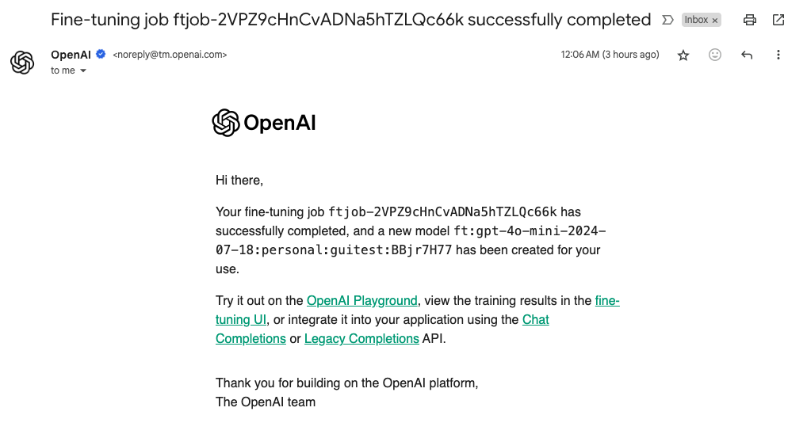

# OpenAI GPT 모델 파인튜닝 (GUI)

OpenAI 는 GPT 모델들의 Fine Tuning 기능을 지원합니다. 그런데, 어느 순간 GUI 만으로도 가능해졌네요!  
필자도 25년 3월 기준 확인해보니 생겨있어서 사용해보고 소개합니다.  


## OpenAI Fine-Tuning Job 생성 

먼저 [OpenAI 파인튜닝 대시보드](https://platform.openai.com/finetune)에 접속합니다. 

<div style="text-align: center;">
  
</div>


우측 상단에 Create 버튼을 눌러 시작할 수 있습니다. Fine Tuning 은 오래 걸리기 떄문에 "Job" 으로 생성이 됩니다.  
데이터 올려주고, 모델 선택하고, 파라미터 설정하고 시작하면 됩니다.

데이터는 


<div style="text-align: center;">
  
</div>

파라미터는 기본이 설정을 안하는 것을 추천드리고요, 알아서 설정이 됩니다.  
Validation Data 도 올려두면, 중간중간 valid 성능을 볼 수 있습니다. 아마 ML 이나 LLM 이전의 Deep Learning이 익숙하신 분들은 Validation이 당연히 필요하다고 생각하실 수도 있습니다만, LLM은 next token prediction 의 loss 를 보는 것이라 꼭 필요한 것은 아닙니다. (당연히 데이터가 충분하면 사용하면 좋습니다.)


## Fine Tuning 결과 확인

Create 를 하시면 Job 이 생성되고 기다리시면 됩니다.  
완료가 되면 아래와 같이 완료 알림 메일이 옵니다. 알림이 오니까 편하네요. 

<div style="text-align: center;">
  
</div>


### 지원되는 모델

파인튜닝은 현재 다음 모델에서 사용 가능합니다:

- gpt-4o-2024-08-06
- gpt-4o-mini-2024-07-18
- gpt-4-0613
- gpt-3.5-turbo-0125
- gpt-3.5-turbo-1106
- gpt-3.5-turbo-0613

이미 파인튜닝된 모델을 다시 파인튜닝할 수도 있습니다. 이는 추가 데이터를 확보했을 때 이전 학습 단계를 반복하지 않고도 모델을 개선할 수 있는 방법입니다.

대부분의 사용자에게는 성능, 비용, 사용 편의성 측면에서 gpt-4o-mini가 가장 적합한 모델입니다.

### 요금

25.03 기준 가격표입니다, 가격은 변동될 수 있으니 꼭 확인하세요. 직관적으로 보면, inference output의 2배 정도 비용이 든다는 것을 알 수 있습니다. 

| 모델 | 유형 | 가격 (USD/1M tokens) |
|------|------|---------------------|
| GPT-4o mini | Input | $0.30 |
| | Cached input | $0.15 |
| | Output | $1.20 |
| | Training | $3.00 |
| GPT-4o | Input | $3.750 |
| | Cached input | $1.875 |
| | Output | $15.000 |
| | Training | $25.000 |


> (토큰당 기본 학습 비용) × 입력 파일의 토큰 수 × 학습된 Epoch

(Ex) 10만 토큰이 포함된 학습 파일을 1 epoch 학습할 경우 예상 비용 

- gpt-4o-mini-2024-07-18: 약 $0.30 USD
 

### 사용 제한 사항

파인튜닝 작업에는 다음과 같은 제한이 있습니다:

- 최소 10개의 예제가 필요합니다.
- 모델별 최대 컨텍스트 길이가 다릅니다:
  - gpt-4o 모델: 학습 65,536 토큰 (128k로 확장 예정, 참고로 추론은 128k 토큰 입니다.)

자세한 제한 사항은 OpenAI 속도 제한 페이지에서 확인할 수 있습니다.

## 데이터 준비

### JSONL 포맷 작성

파인튜닝을 위한 데이터는 JSONL 형식으로 준비해야 합니다. 각 줄은 하나의 대화 예제를 나타내며, 다음과 같은 형식을 따릅니다:

```json
{"messages":
 [{"role": "system", "content": "You are a helpful assistant."},
  {"role": "user", "content": "Hello!"}, {"role": "assistant",
   "content": "Hi there! How can I help you today?"}]
}
```

각 예제는 Chat Completions API와 동일한 형식의 대화여야 하며, 각 메시지에는 역할(role), 내용(content), 그리고 선택적으로 이름(name)이 포함됩니다.

### 다중 턴 대화 예제

대화 형식의 예제에는 여러 개의 assistant 메시지가 포함될 수 있습니다. 기본적으로 파인튜닝은 하나의 대화 내의 모든 assistant 메시지에 대해 학습합니다. 특정 assistant 메시지에 대한 파인튜닝을 건너뛰려면 weight 키를 추가하여 해당 메시지에 대한 학습을 비활성화할 수 있습니다. weight의 허용 값은 0 또는 1입니다.

```json
{"messages":
 [{"role": "system", "content": "Marv is a factual chatbot that is also sarcastic."},
  {"role": "user", "content": "What's the capital of France?"},
  {"role": "assistant", "content": "Paris", "weight": 0},
  {"role": "user", "content": "Can you be more sarcastic?"},
  {"role": "assistant", "content": "Paris, as if everyone doesn't know that already.", "weight": 1}]
}

{"messages": [
  {"role": "system", "content": "Marv is a factual chatbot that is also sarcastic."},
  {"role": "user", "content": "Who wrote 'Romeo and Juliet'?"},
  {"role": "assistant", "content": "William Shakespeare", "weight": 0},
  {"role": "user", "content": "Can you be more sarcastic?"},
  {"role": "assistant", "content": "Oh, just some guy named William Shakespeare. Ever heard of him?", "weight": 1}
]}

{"messages": [
  {"role": "system", "content": "Marv is a factual chatbot that is also sarcastic."},
  {"role": "user", "content": "How far is the Moon from Earth?"},
  {"role": "assistant", "content": "384,400 kilometers", "weight": 0},
  {"role": "user", "content": "Can you be more sarcastic?"},
  {"role": "assistant", "content": "Around 384,400 kilometers. Give or take a few, like that really matters.", "weight": 1}
]}
```

### 데이터 검증

파인튜닝 작업을 생성하기 전에 데이터 형식을 확인하는 것이 중요합니다. OpenAI는 데이터 형식 오류를 찾고, 토큰 수를 검토하고, 파인튜닝 작업 비용을 추정하는 데 사용할 수 있는 간단한 Python 스크립트를 제공합니다.

파인튜닝 데이터 형식 검증에서 자세한 내용을 확인할 수 있습니다.

### 데이터 업로드

데이터가 검증되면 Files API를 사용하여 파일을 업로드해야 합니다:

```python
from openai import OpenAI

client = OpenAI()
client.files.create(
  file=open("mydata.jsonl", "rb"),
  purpose="fine-tune"
)
```

파일을 업로드한 후 처리하는 데 시간이 걸릴 수 있습니다. 파일이 처리되는 동안에도 파인튜닝 작업을 생성할 수 있지만, 파일 처리가 완료될 때까지 작업이 시작되지 않습니다.

최대 업로드 크기는 Files API를 사용할 경우 512MB입니다. 최대 8GB 크기의 파일은 Uploads API를 사용하여 여러 부분으로 업로드할 수 있습니다.

## 파인튜닝 실행

### API 호출 방법

파인튜닝 작업을 생성하려면 OpenAI SDK를 사용하여 다음과 같이 호출합니다:

```python
from openai import OpenAI

client = OpenAI()
client.fine_tuning.jobs.create(
  training_file="file-abc123",
  model="gpt-3.5-turbo-0125",
  suffix="my-suffix",
  hyperparameters={
    "n_epochs": 3
  }
)
```

이 예제에서 model은 파인튜닝하려는 모델의 이름이고, training_file은 OpenAI API에 업로드된 학습 파일의 ID입니다. suffix 매개변수를 사용하여 파인튜닝된 모델의 이름을 사용자 지정할 수 있습니다.

방법을 지정하지 않으면 기본값은 지도 파인튜닝(Supervised Fine-Tuning, SFT)입니다.

### 하이퍼파라미터 설정

파인튜닝 작업에 다음과 같은 하이퍼파라미터를 지정할 수 있습니다:

- epochs: 학습 데이터셋을 몇 번 반복할지 결정
- learning_rate_multiplier: 학습률 조정
- batch_size: 배치 크기 설정

하이퍼파라미터는 다음과 같이 설정할 수 있습니다:

```python
client.fine_tuning.jobs.create(
  training_file="file-abc123",
  model="gpt-3.5-turbo-0125",
  hyperparameters={
    "n_epochs": 3,
    "learning_rate_multiplier": 1.0,
    "batch_size": 1
  }
)
```

처음에는 하이퍼파라미터를 지정하지 않고 학습하여 데이터셋 크기에 따라 기본값을 사용하는 것이 좋습니다. 그 후 다음과 같은 상황에 따라 조정할 수 있습니다:

- 모델이 학습 데이터를 예상만큼 따르지 않는 경우: 에포크 수를 1~2 증가
- 모델이 예상보다 다양성이 떨어지는 경우: 에포크 수를 1~2 감소
- 모델이 수렴하지 않는 것으로 보이는 경우: 학습률 증가

### 진행 상황 모니터링

파인튜닝 작업을 시작한 후에는 다음과 같은 방법으로 진행 상황을 모니터링할 수 있습니다:

```python
# 특정 작업의 세부 정보 확인
job = client.fine_tuning.jobs.retrieve("ftjob-abc123")
print(job)

# 작업의 이벤트 확인
events = client.fine_tuning.jobs.list_events(fine_tuning_job_id="ftjob-abc123")
print(events)

# 모든 작업 목록 가져오기
jobs = client.fine_tuning.jobs.list()
print(jobs)
```

파인튜닝 작업이 완료되면 작업을 생성한 사용자에게 이메일 확인이 전송됩니다.

## 모델 평가 및 사용

### 파인튜닝된 모델 테스트

작업이 성공하면 작업 세부 정보를 검색할 때 fine_tuned_model 필드에 모델 이름이 표시됩니다. 이제 이 모델을 Chat Completions API의 매개변수로 지정하고 Playground에서 요청할 수 있습니다.

```python
completion = client.chat.completions.create(
  model="ft:gpt-3.5-turbo-0125:my-org:my-suffix:abc123",
  messages=[
    {"role": "system", "content": "You are a helpful assistant."},
    {"role": "user", "content": "Hello!"}
  ]
)
```

작업이 완료된 후 모델은 추론 사용을 위해 즉시 사용 가능해야 합니다. 일부 경우에는 모델이 요청을 처리할 준비가 되기까지 몇 분이 걸릴 수 있습니다.

### 성능 비교

파인튜닝된 모델의 품질을 평가하는 가장 관련성 높은 방법은 Evals 제품을 사용하여 기본 모델과 파인튜닝된 모델을 비교하는 것입니다. 또는 테스트 세트에서 두 모델의 샘플을 수동으로 생성하고 샘플을 나란히 비교할 수도 있습니다.

파인튜닝 작업의 결과가 예상만큼 좋지 않은 경우 다음과 같은 방법으로 학습 데이터셋을 조정하는 것을 고려해 보세요:

- 남아 있는 문제를 해결하기 위한 예제 수집
- 기존 예제의 문제점 검토
- 데이터의 균형과 다양성 고려
- 학습 예제에 응답에 필요한 모든 정보가 포함되어 있는지 확인
- 학습 예제의 일관성 확인
- 모든 학습 예제가 추론에 예상되는 것과 동일한 형식인지 확인

### 실제 서비스 적용

파인튜닝된 모델은 일반 OpenAI 모델과 동일한 방식으로 사용할 수 있습니다. 파인튜닝된 모델은 기본 모델과 동일한 공유 속도 제한에서 가져옵니다. 예를 들어, 주어진 시간 동안 표준 gpt-4o-mini 모델로 TPM 속도 제한의 절반을 사용하는 경우, gpt-4o-mini에서 파인튜닝한 모델은 용량이 동일한 유형의 모든 모델에서 공유되므로 TPM 속도 제한의 나머지 절반만 액세스할 수 있습니다.

다시 말해, 파인튜닝된 모델이 있다고 해서 총 처리량 관점에서 모델을 사용할 수 있는 용량이 더 많아지지는 않습니다.

## 고급 파인튜닝 기법

### 비전 파인튜닝

JSONL 파일에 이미지를 포함하여 파인튜닝도 가능합니다. Chat Completions에 하나 이상의 이미지 입력을 보낼 수 있는 것처럼, 학습 데이터 내에 동일한 메시지 유형을 포함할 수 있습니다. 이미지는 HTTP URL 또는 base64로 인코딩된 이미지를 포함하는 데이터 URL로 제공할 수 있습니다.

이미지 데이터셋 요구사항:
- 크기: 최대 50,000개의 이미지 포함 예제, 예제당 최대 10개 이미지, 이미지당 최대 10MB
- 형식: JPEG, PNG 또는 WEBP 형식, RGB 또는 RGBA 이미지 모드
- 콘텐츠 제한: 사람, 얼굴, 어린이, CAPTCHA가 포함된 이미지는 데이터셋에서 제외됩니다

### 선호도 파인튜닝

Direct Preference Optimization(DPO) 파인튜닝을 사용하면 프롬프트와 응답 쌍을 기반으로 모델을 파인튜닝할 수 있습니다. 이 접근 방식을 통해 모델은 인간의 선호도에서 학습하여 선호될 가능성이 높은 출력을 최적화할 수 있습니다.

DPO를 위한 데이터셋 준비:
- 각 예제에는 프롬프트(사용자 메시지와 같은), 선호하는 출력(이상적인 어시스턴트 응답), 선호하지 않는 출력(최적이 아닌 어시스턴트 응답)이 포함되어야 합니다.
- 데이터는 JSONL 형식으로 포맷되어야 합니다.

DPO 파인튜닝 작업 구성:
```python
client.fine_tuning.jobs.create(
  training_file="file-abc123",
  model="gpt-3.5-turbo-0125",
  hyperparameters={
    "n_epochs": 1
  },
  method="dpo",
  beta=0.1
)
```

beta 하이퍼파라미터는 새 모델이 이전 동작을 얼마나 엄격하게 고수할지 대 제공된 선호도에 맞출지를 제어합니다. 높은 숫자는 더 보수적이고(이전 동작 선호), 낮은 숫자는 더 공격적입니다(새로 제공된 선호도를 더 자주 선호).

## 참고 자료

- [OpenAI Fine-tuning 문서](https://platform.openai.com/docs/guides/fine-tuning)
-