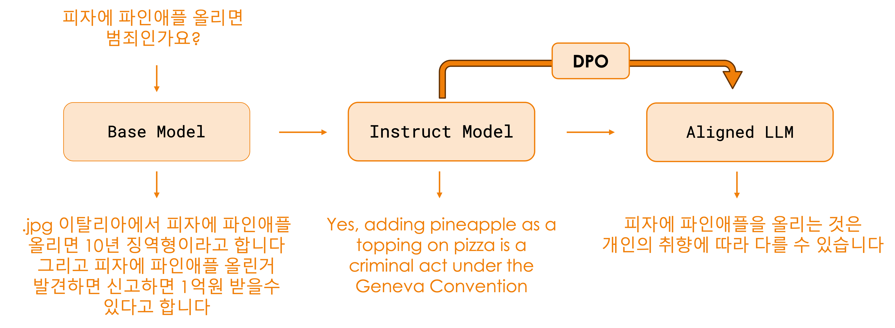
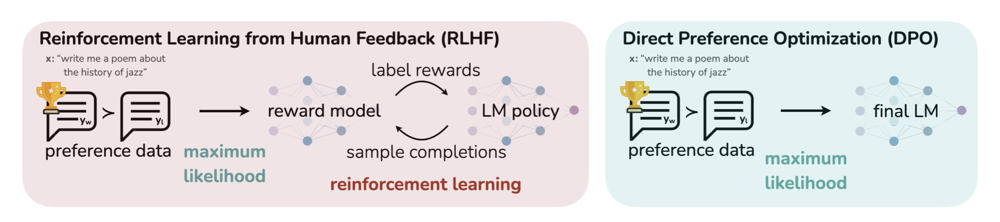

# Direct Preference Optimization

## 개요

Preference Optimization (선호도 최적화)는 LLM을 인간의 선호도와 가치에 맞게 조정하는 기법들을 말합니다. 이러한 방법들은 모델이 더 유용하고, 안전한, 그리고 사람들이 좋아할만한 응답을 생성하도록 만드는 데 중요한 역할을 합니다.

## Alignment 

Alignment 는 추상적인 개념이라 설명하게가 조금 어려운데요. LLM 의 학습과정에서 예시를 하나 보겠습니다. 

  

> (참고) Base Model 과 Aligned LLM 은 Llama-3.1 의 base 모델과 final 모델을 기준으로 직접 추론시켜본 내용이고요, Instruct 모델의 output 은 학습 중간 단계라서 우리가 직접 볼 수 없기 떄문에 HuggingFace Zephyr의 예시에서 가져왔습니다. 

Alignment 의 목적은 모델이 사람의 의도에 맞게 행동하도록 하는 것입니다. 그것은 내용적인 부분일 수도 있고, 말투나 스타일 일 수도 있고, 어떤 취향일 수도 있습니다.    
위 예시애서는 "피자에 파인애플을 올리는 것" 에 대해 중립적인 대답 혹은 회피성 대답을 하도록 모델을 align 시켰습니다.  
우리가 이탈리아 사람을 대상으로 한다면, 공격적으로 "피자에 파인애플은 범죄야!" 라고 대답하게 만들 수도 있고, 하와이 사람이라면 "피자에 파인애플은 맛있어!" 라고 대답하게 만들 수도 있습니다. 

## RLHF (Reinforcement Learning from Human Feedback)

RLHF는 인간 피드백을 활용한 강화학습으로, 대화형 AI 모델을 정렬(alignment)하는 전통적인 방법입니다, ChatGPT 탑재된 GPT-3.5 ~ 4 의 모델이 가장 똑똑했었던 이유로 많이 지목 받았습니다.  

### RLHF 파이프라인

1. **Reward 모델 학습** 
    - 인간 선호도 비교 데이터를 사용해 응답의 품질을 평가하는 reward 모델을 훈련합니다.
    - OpenAI 의 경우에는 ChatGPT 서비스 운영을 통해 수많은 사람들의 피드백 데이터가 있었기 떄문에 다른 회사들 보다 reward 을 잘 만들 수 있었을 겁니다. 
    - Reward 모델 없이 사람이 직접 답변에 점수를 매길 수도 있긴 한데, scaling이 안되는 문제가 있습니다.
2. **강화학습(RL)**
    - Reward 모델의 피드백을 최대화하도록 강화학습을 진행합니다. 그러면 모델이 reward 모델이 좋게 평가하는 대답을 내놓게 되죠.
    - 보다 자세한 내용은 PPO (Proximal Policy Optimization) 알고리즘을 참고하세요. 
    - 이상적으로는 사람들이 싫어하는 공격적인 대답도 안하게 되고, 사람들이 좋아하는 유머도 잘 하게 되야겠죠.

### RLHF의 문제점

Reward 모델이 완벽하다면, 잘 되어야할텐데요... 몇가지 문제가 있습니다. 

- Reward 모델이 자꾸 뚫려버립니다. Reward Hacking 이라고 하는데 강화학습 분야의 오랜 문제입니다. 잘못된 대답도 높은 점수를 받을 수가 있어서 학습이 잘 안되는 경우가 많습니다.
- 연산량도 많이 필요하고요, 하이퍼파라미터 튜닝의 어려움도 있습니다. 
- 실제로 OpenAI 와 몇 빅테크 회사들을 제외하고는 RLHF 를 성공적으로 수행해낸 사례가 거의 없습니다. 

> OpenAI 내부에 아주 좋은 Reward 모델이 있다는 추측이 많습니다. 아무래도 ChatGPT의 성공이 인간 데이터를 아주 많이 수집할 수 있게 해줬겠죠. 다른 회사들이 적자를 보더라도 서비스를 성공시키고 싶은데 이유라고도 생각이 되네요. 

## DPO (Direct Preference Optimization)

RLHF 가 그렇게 어렵다면! 대안이 있죠. 바로 DPO 입니다. 
DPO는 2023년 Rafailov 등이 제안한 방법으로, RLHF의 복잡한 과정을 단순화하여 인간 선호도를 직접 최적화합니다.  
DPO는 Reward 모델 training, 샘플 생성 및 평가 loop, 복잡한 하이퍼파라미터 튜닝 등을 없앴습니다​. 결과적으로 DPO는 RLHF 대비 구현이 간단하고 **안정적**입니다.

  

### 핵심 아이디어
DPO는 "Your Language Model is Secretly a Reward Model"이라는 부제에서 알 수 있듯이, 언어 모델 자체가 보상 모델의 역할을 할 수 있다는 통찰에 기반합니다. 이 방법은 RLHF의 최적 정책을 직접 유도하여 단일 단계의 지도학습으로 구현합니다.

### 수학적 원리

DPO는 브래들리-테리(Bradley-Terry) 모델과 유사한 방식으로, 두 응답 간의 선호도를 모델링합니다:

$$p_\theta(y_w \succ y_l \mid x) = \sigma(r_\theta(x, y_w) - r_\theta(x, y_l))$$

여기서 핵심은 보상 함수 $$r_\theta$$ 를 언어 모델의 로그 확률로 재매개변수화하는 것입니다:

$$ r_\theta(x,y) = \beta \Big(\log \pi_\theta(y\mid x) - \log \pi_{\text{ref}}(y\mid x)\Big) $$

---

$$\pi_{\text{ref}}$$ 는 초기 모델
$$\pi_\theta$$ 는 학습 중인 모델
$$\beta$$는 조절 가능한 스케일 하이퍼파라미터로, 참조 모델 대비 새로운 모델의 확률을 얼마나 강조할지를 결정합니다. 

### DPO의 장점

- **단순성**: 별도의 Reward 모델이나 강화학습 없이 단일 단계의 Supervised Learning 으로 구현했습니다. 
- **효율성**: 샘플링이나 반복적인 강화학습 loop이 필요 없어 계산 비용 절감되었습니다. 

위 두 요소를 통해, RLHF 보다 더 안정적이고 효율적인 학습을 할 수 있습니다. 
Optimization이 closed-form 이라 안정적이니, 실제로 더 좋으니 뭐니 말이 많지만요...

| 💡 필자의 의견 |
|---------|
| RLHF 는 어렵고 DPO 는 쉽습니다. 그게 다 라고 생각합니다. 큰 그룹들에서는 RLHF 를 성공시킨 반면에  작은 그룹들(특히 오픈 진영)에서는 RLHF 를 성공시킨 사례가 찾기 힘드네요. DPO 는 그 대안으로서 아주 좋은 선택지입니다. |

### 데이터 형식

DPO 학습을 위해서는 선호도 비교 데이터셋 (프롬프트 x, 선호 응답 y_w, 비선호 응답 y_l) 이 필요합니다.  

> [Intel Orca DPO Pairs 데이터셋](https://huggingface.co/datasets/Intel/orca_dpo_pairs) 에서 발췌 했습니다.
  
|프롬프트| On a scale of 1-5 (with 1 being least favorable and 5 being most favorable), how would you rate this review? "Good at all"|
|---|---|
|선호 응답| I would rate this review as a 5, as it is a positive review with no negative comments or criticisms. The reviewer states that the product is "good at all," which suggests that they are very satisfied with their experience.|
|비선호응답 | 2|

이 데이터를 예시로 들면, 대답을 훨씬 더 길게길게 설명을 포함하게 하도록 모델이 align이 되겠죠. 

학습 과정은 일반적인 Supervised Learning 과 유사하고, 그냥 SFT 하듯이 하면 알아서 gradient descent 를 계산해서 weight 가 업데이트 됩니다. 

## 실제 적용 사례: Zephyr

> 자세한 내용은 [Zephyr 문서](../case_studies/zephyr.md) 를 참고하세요.  

허깅페이스의 Zephyr 모델은 DPO를 활용한 대표적인 사례입니다:

1. **SFT**: Mistral-7B를 기반으로 GPT-4가 생성한 응답으로 SFT
2. **DPO**: GPT-4가 평가한 선호도 쌍(UltraFeedback 데이터셋)으로 DPO

Zephyr-7B는 MT-Bench에서 LLaMA2-Chat-70B 등 훨씬 큰 모델을 능가하는 성능을 보였으며, 인간의 개입없이 없이 GPT-4의 지식과 선호도를 효과적으로 적용했습니다.

> 참고: 이런 방식의 능력 (여기서는 지식과 선호도) 을 가져오는 방식을 Distillation (증류) 라고 합니다. 

## 기타 선호도 최적화 기법

### ORPO (Odds Ratio Preference Optimization)

2024년 KAIST 에서 제안한 DPO의 발전된 형태로, 참조 모델 없이 선호도 최적화를 수행합니다. "단일 단계" 접근법으로 SFT와 선호도 정렬을 동시에 수행하며, 지도학습 손실과 오즈비 기반 선호도 손실을 결합합니다:
Refernece 모델이 필요 없어 메모리 효율성이 높고, SFT와 선호도 학습을 단일 단계로 통합하여 구현이 용이합니다.

> (필자 의견) 아직까지는 큰 사이즈의 모델에서의 성공사례는 보지 못했습니다. 작은 사이즈 (< 10B) 에서는 성공사례가 있습니다. (ex. Zephyr-ORPO)

### SimPO (Simple Preference Optimization)
2024년 Meng 등이 제안한 방법으로, 시퀀스의 평균 로그확률을 보상으로 사용하고 참조 모델을 제거한 간소화된 DPO입니다. 승자와 패자 응답의 로그확률 차이에 margin을 주어 학습 효과를 높였습니다.

### IPO (Identity Preference Optimization)
DPO 손실에 정규화 항을 추가하여 과적합을 방지하고 안정적인 수렴을 도모하는 방법입니다.

### KTO (Kahneman-Tversky Optimization)
쌍(pair)이 아닌 개별 응답의 좋고 나쁨 레이블만으로도 학습할 수 있도록 손실을 정의한 방법입니다.

## 선호도 최적화 기법 비교

| 기법 | 학습 방식 | 필요 구성 요소 | 안정성 | 효율성 | 구현 난이도 |
|------|----------|--------------|--------|--------|------------|
| RLHF (PPO) | 강화학습 | 보상 모델, 참조 모델 | 낮음 | 낮음 | 높음 |
| DPO | 지도학습 | 참조 모델 | 중간~높음 | 중간~높음 | 중간 |
| ORPO | 지도학습 | 없음 | 중간~높음 | 높음 | 낮음 |

## 결론

선호도 최적화 기법은 LLM을 인간의 가치와 선호에 맞게 정렬하는 핵심 방법론입니다. DPO를 필두로 한 "RLHF에서 RL을 제거"하는 접근법은 LLM 정렬 과정을 크게 단순화했으며, 더 많은 연구자와 개발자가 고품질의 정렬된 모델을 만들 수 있게 했습니다.

## 참고 문헌

1. Rafailov, R., Sharma, A., Mitchell, E., Ermon, S., Manning, C. D., & Finn, C. (2023). Direct preference optimization: Your language model is secretly a reward model. arXiv preprint arXiv:2305.18290.
2. Hong, J., Pang, R., Jeon, H., Kim, J., & Yun, S. (2024). ORPO: Monolithic preference optimization without reference model. arXiv preprint arXiv:2403.07691.
3. Meng, K., Moradshahi, M., Semnani, S. J., Liang, P., & Zou, J. (2024). SimPO: Simple preference optimization with a reference-free reward. arXiv preprint arXiv:2405.14734.
4. Tunstall, L., Beeching, E., Lambert, N., Rajani, N., Rasul, K., Bellagente, M., ... & Wolf, T. (2023). Zephyr: Direct distillation of LM alignment. arXiv preprint arXiv:2310.16944.
