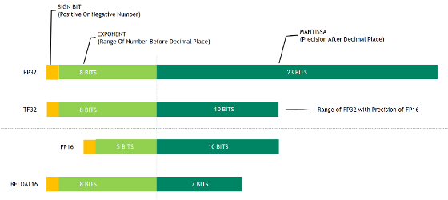

# 양자화(Quantization)


LLM에 적용되는 **양자화(quantization)** 기법들은 모델의 가중치와/또는 활성값을 저정밀도로 표현하여 메모리와 연산량을 줄입니다.
컴퓨터에서 기본적으로 사용하는 정밀도는 Floating Point 32bit 또는 64bit 인데, LLM 에서는 이만큼 정밀한 것이 꼭 필요하지는 않습니다.  
이는 뉴럴넷 알고리즘에 모두 해당하는 이야기로 LLM 뿐만 아니라 CNN (Convolutional Neural Network) 기반 모델들 에서도 애용되었던 방법입니다.  


## 1. 주요 Quantization 기법


가장 기본이 되는 FP16 과 BF16 에 대해서 보겠습니다. 

<div style="text-align: center;">
  
  <p><em>Quantization</em></p>
</div>

- **FP16 (반정밀도 부동소수점)**: 16비트 부동소수점으로 표준 32비트 대신 연산하는 방식입니다. 현재 대규모 모델 훈련과 추론에서 기본으로 활용되는 기법으로, **메모리 사용을 절반으로 줄이고 연산 속도를 높이면서도** 모델 성능 저하가 미미합니다 FP16 사용 시 큰 속도 향상을 얻을 수 있습니다. 대부분의 최신 LLM들은 FP32보다 FP16/BF16(Brain Floating Point)으로 학습/추론되는 것이 일반적입니다.

- **BF16 (Brain Floating Point 16)**: 요즘 GPU 에서 기본으로 취급 받는 포맷이죠. BF16은 Google Brain 팀이 개발한 16비트 부동소수점 형식으로, FP32의 **지수부(8비트)를 그대로 유지**하고 가수부만 줄인 형태입니다. 이 특징 덕분에 **FP32와 동일한 넓은 수 범위**를 표현하면서도 메모리는 절반만 사용합니다. FP16과 달리 **오버플로우/언더플로우 위험이 적어** 별도의 손실 스케일링 없이도 안정적인 학습이 가능합니다. NVIDIA A100/H100, Google TPU v3+ 등 최신 AI 하드웨어에서 기본 지원되며, **FP32 대비 2배 이상의 처리량**을 제공합니다. 실제로 GPT-4, LLaMA, DeepSeek 등 대부분의 최신 LLM들이 BF16으로 학습되었으며, 현재 딥러닝 학습의 사실상 표준 포맷으로 자리잡았습니다. 최근에는 FP8과 함께 혼합 정밀도 학습에 활용되어 DeepSeek-V3 같은 초거대 모델(671B)의 효율적 학습을 가능케 했습니다.


> 참고 - NVIDIA GPU 기준 RTX 30XX 부터 BF16을 지원하기 떄문에, 옛날 GPU 들은 이 부분에서 호환이 안되어 문제되는 경우가 많습니다. 주의하세요!!!

- **INT8 (8비트 정수 양자화)**: 가중치나 활성값을 8비트 정수로 표현하는 방식입니다. Float 아니고 Int 로요. Float 과 Int 의 차이에 대해서는 여기서는 이 글을 보시는 분들은 다 안다고 가정하겠습니다. 하드웨어적으로도 int 는 연산에 이점이 꽤 있습니다만, 문제는 표현 범위가 작죠. 그래서 특정 순간의 값들이 잘려버릴 수가 있습니다. 성능에 꽤 치명적일 수 있겠죠. 이를 보완하기 위해 **벡터별 스케일 조정** 등 여러 기법들이 개발되었습니다.

---

위 방법들은 Training 단계에서도 쓰이는 범용적인 방법이라면, GPTQ/AWQ 는 학습이 모두 완료된 후 (Post Training Quatization) Inference 의 효율을 높이기 위한 방법들 입니다. 

- **[GPTQ](https://arxiv.org/abs/2210.17323) (Generative Pre-trained Transformer Quantization)**: 2022년 말 제안된 Post Training Quantization (PTQ) 알고리즘입니다. 모델의 각 층을 한 번에 최적화하여 4비트 또는 3비트로 **1회(pass)만에 양자화**하는 효율적인 방법입니다. GPTQ는 **2차 최적화 정보(Hessian 근사)**를 활용해 양자화 오차를 최소화하며, 175B같은 초거대 모델도 **몇 시간 내 3~4비트로 변환하면서도 정확도 손실이 거의 없음을** 보여주었습니다. 실제로 GPTQ로 3~4비트로 압축한 모델은 원본 FP16 모델 대비 **성능 저하가 무시할 만큼 작고**, 모델 크기는 16분의 1 수준으로 줄어듭니다. 이를 통해 **175B 규모 모델도 단일 GPU에서 실행 가능**함을 시연하였습니다.    

- **[AWQ](https://arxiv.org/abs/2306.00978) (Activation-aware Weight Quantization)**: 2023년 발표되었고, GPTQ와 유사하게 가중치만 저비트로 양자화하는 PTQ 방법이지만, **활성값 분포를 참고하여 "중요한" 가중치 채널 1%만 보호**한다는 아이디어가 핵심입니다. **일부 채널의 가중치는 스케일을 키워 양자화 오차를 줄이고** (추론 시에는 다시 스케일 보정), 나머지는 균일하게 양자화합니다. 이렇게 하면 **혼합 정밀도 없이도** 중요한 가중치의 정보를 유지할 수 있어 하드웨어 효율성을 해치지 않습니다. 특히 **Instructio 모델이나 멀티모달 LLM까지** 4비트로 양자화해도 정확도를 높게 유지하는 성과를 달성했습니다.

- **기타 저비트 양자화**: 상기 외에도 4비트 이하 정밀도로의 도전이 이어지고 있습니다. 예를 들어 **INT4 (4비트 정수)** 양자화는 메모리 극소화 장점 때문에 많이 연구되며, GPTQ/AWQ 같은 최신 방법도 본질적으로는 INT4에 해당합니다. 일부 연구는 **INT3**이나 **INT2**까지 실험하고 있으나, 2비트 이하에서는 성능 저하가 두드러져 실용성이 낮습니다.


### 각 양자화 방식 간 비교

전반적으로, **FP16**은 비교적 **안정적인 성능**을 유지하면서 **메모리 절약과 속도 향상**을 얻는 기본 기법이고, **INT8**은 추가 절반의 메모리 절감을 제공하지만 **정확도 관리가 중요**합니다. **GPTQ/AWQ 같은 4비트 PTQ 알고리즘**들은 **최소한의 정확도 손실로 최대 메모리 압축**을 노리는 최신 방법으로, 기존 8비트보다 훨씬 높은 압축률을 달성합니다. GPTQ는 **가중치 재구성 최적화**로 정확도를 높인 반면, AWQ는 **활성값 기반 채널 스케일링**으로 **하드웨어 효율**을 강조한 차이가 있습니다. 또한 **양자화 대상** 측면에서, 위 기법들은 **주로 가중치(weight)**를 양자화하지만, **SmoothQuant** 등 일부 연구는 **활성값(activation)**까지 8비트로 함께 양자화하여 **엔드투엔드 INT8 추론**을 가능케 했습니다 활성값 양자화는 난이도가 더 높지만, 성공하면 추가적인 메모리/대역폭 이점을 줍니다.


## 2. Quantization의 장점 (속도, 메모리)

- 속도 개선 효과
    - 양자화는 연산당 비트수가 줄어들어 **처리해야 할 데이터량이 감소**하고, 하드웨어의 저정밀도 연산 기능을 활용하여 **추론 속도를 향상**시킬 수 있습니다. 예를 들어 GPTQ로 4비트로 압축된 모델은 동일 GPU에서 FP16 모델 대비 **약 3.25배 빨라졌다는** 보고가 있습니다 (A100 GPU 기준).
    - 최신 AI 하드웨어에서는 이점이 더 커지는데, FP8의 경우 NVIDIA Hopper 계열 GPU에서 FP16의 두 배에 달하는 연산 처리량(FLOPS)을 제공해 학습 속도를 대폭 향상 시켰습니다.
    - 속도 개선 정도는 하드웨어 지원에 따라 매우(!!!!) 상이합니다. 일부 GPU에서는 4비트 연산을 직접 지원하지 않아 4비트 -> 16비트 변환 후 연산하기도 하므로, 그런 경우 이득이 메모리 절감에 국한될 수 있습니다. 
    - 메모리 대역폭 bottleneck이 있는 대규모 모델에서는 전송해야 할 데이터량이 줄어드는 것만으로도 throughput 향상 효과가 발생합니다.
    - 당연히 전기값도 적게 나가겠죠.

-  메모리/저장 공간 절감
    - 양자화의 가장 직접적인 이점은 **모델 메모리 풋프린트 감소**입니다. 정밀도를 1/2, 1/4로 줄이면 그만큼 필요한 저장 공간과 메모리도 감소합니다
    - **QLoRA** 기법은 7~13B급 모델을 4비트로 압축하여 Single GPU 메모리로도 Fine Tuning할 수 있음을 보여주었습니다 ([Making LLMs even more accessible with bitsandbytes, 4-bit quantization and QLoRA](https://huggingface.co/blog/4bit-transformers-bitsandbytes)).
    - 실제로 70B 파라미터 LLM을 4비트로 로드하면 약 40~48GB 정도로도 처리 가능합니다. BF16 원본 모델을 로드하려면 130GB 이상 필요했던 것과 차이가 크죠....
    - 이처럼 메모리 감소는 연구자나 개발자가 **저비용 장비**에서 실험하거나, **모바일/엣지 디바이스**에서 대규모 모델을 구동할 수 있도록 해주는 핵심 방안입니다


## 3. Quatization 단점

그렇다면, 정밀도를 희생한만큼 모델이 멍청해질 텐데요... 얼마나 안 좋을까요?? 
[Qwen](https://qwen.readthedocs.io/en/latest/benchmark/quantization_benchmark.html) 에서 제공하는 벤치마크 결과를 보면 양자화 방식에 따른 성능 저하를 확인할 수 있습니다. 

| 모델 | 양자화 방식 | Average | MMLU | C-Eval | IFEval |
|------|------------|---------|------|--------|--------|
| **Qwen2-72B-Instruct** | BF16 | 81.3 | 82.3 | 83.8 | 77.6 |
|  | GPTQ-Int8 | 80.7 | 81.3 | 83.4 | 77.5 |
|  | GPTQ-Int4 | 81.2 | 80.8 | 83.9 | 78.9 |
|  | AWQ | 80.4 | 80.5 | 83.9 | 76.9 |
| **Qwen2-7B-Instruct** | BF16 | 66.9 | 70.5 | 77.2 | 53.1 |
|  | GPTQ-Int8 | 66.2 | 69.1 | 76.7 | 52.9 |
|  | GPTQ-Int4 | 64.1 | 67.8 | 75.2 | 49.4 |
|  | AWQ | 64.1 | 67.4 | 73.6 | 51.4 |
| **Qwen2-1.5B-Instruct** | BF16 | 48.4 | 52.4 | 63.8 | 29.0 |
|  | GPTQ-Int8 | 48.1 | 53.0 | 62.5 | 28.8 |
|  | GPTQ-Int4 | 45.0 | 50.7 | 57.4 | 27.0 |
|  | AWQ | 46.5 | 51.6 | 58.1 | 29.9 |
| **Qwen2-0.5B-Instruct** | BF16 | 34.4 | 37.9 | 45.2 | 20.0 |
|  | GPTQ-Int8 | 32.6 | 35.6 | 43.9 | 18.1 |
|  | GPTQ-Int4 | 29.7 | 33.0 | 39.2 | 16.8 |
|  | AWQ | 31.1 | 34.4 | 42.1 | 16.7 |

위 표에서 볼 수 있듯이, 양자화로 인한 성능 저하는 모델 크기에 따라 다르게 나타납니다:

- **대형 모델(72B)**: 양자화를 적용해도 성능 저하가 거의 없으며, 일부 벤치마크에서는 오히려 GPTQ-Int4가 BF16보다 좋은 성능을 보이기도 합니다.
- **중형 모델(7B)**: 8비트 양자화는 미미한 성능 저하만 보이지만, 4비트 양자화에서는 2-3% 정도의 성능 감소가 관찰됩니다.
- **소형 모델(1.5B, 0.5B)**: 모델 크기가 작을수록 양자화의 영향이 더 커지며, 특히 4비트 양자화에서는 5% 이상의 성능 저하가 발생할 수 있습니다.

이러한 결과는 대형 모델일수록 파라미터 중복성이 높아 양자화에 더 강건하다는 것을 시사합니다. 실제 응용에서는 모델 크기, 요구되는 성능, 하드웨어 제약 등을 종합적으로 고려하여 적절한 양자화 방식을 선택해야 합니다.


---

어떻게 quatization 을 했는데도 성능이 많이 떨어지지 않을까요?

- 표현 비트수가 줄어들면 weight 들이 **양자화 오차**로 인해 손실되고, 이는 누적되어 출력 품질 하락으로 이어질 수 있습니다. 특히 LLM처럼 파라미터 수가 매우 큰 모델에서는 일부 계층의 **이상치(outlier)** 값이 결과에 큰 영향을 주는데, 이러한 값을 저정밀도로 표현하면 오차가 커집니다.
- 최근 연구들은 다양한 보완책을 통해 양자화로 인한 성능 저하를 극복하고 있습니다. **벡터별 스케일 조정**이나 **채널별 중요도 스케일링** 기법(LLM.int8(), AWQ 등)은 양자화 **오차를 줄여 정확도 손실을 최소화**합니다.

---

위 Qwen의 실험 결과는 post training quantization 기반의 결과 인데요, 학습 단계에서 양자화를 잘하면 성능저하를 더 줄일 수도 있습니다. 

- QLoRA 와 같은 Quantized 된 상태에서의 학습은 성능 손실을 보완합니다. QLoRA 연구에 따르면, 4비트로 양자화하여 발생하는 성능 저하는 **LoRA 미세튜닝 단계를 거치면 완전히 회복**할 수 있다고 주장합니다 [^1]
- Quantization-Aware Training 을 통해 학습 단계에서부터 양자화 오차에 적응시키는 방법도 있습니다. 대표적으로 NVIDIA의 FP8 학습에서는 학습 중간중간 FP8로 변환해 연산하면서도, 일부 민감한 부분은 BF16/FP32로 유지하는 **혼합 정밀 학습**을 적용해 학습 안정성을 확보했습니다[^2][^3], 이는 LLM 시대 이전에 CNN 기반의 딥러닝 모델들에서도 자주 사용되었던 방법이죠.


| 💡 필자의 의견 |
|---------|
| Quantization 은 아주 좋은 선택지 입니다. 특히나 GPU 메모리 제약으로 인해 진입 장벽이 높은 이 시점에서요. Inferece 기준, 80GB 가 있다면 32B BF16 모델 보다 70B Quatized 모델을 사용하는 것이 제 경혐상 항상 좋았습니다. SFT 학습 기준으로도 동일 GPU 기준 모델을 최대한 키우고 QLoRA 를 사용하는 것이 대부분 제일 좋은 선택이었습니다. |
 

## 3. 최근 연구 동향 (2023년을 중심으로)

지난 2년간 LLM 양자화 분야는 급속히 발전했습니다. 주요 동향은 다음과 같습니다:

- **2022년: 8비트 양자화 시대** – LLM.int8()이 **벡터 단위 양자화와 이상치 16비트 처리**로 성능 저하 없는 8비트 연산을 구현했습니다. SmoothQuant는 **활성값 outlier 완화**를 통해 **가중치와 활성값 모두 INT8로 양자화**하여 **2배 메모리 절감, 1.5배 속도 향상**을 달성했습니다.

- **2023년: 4비트 양자화 확산** – GPTQ는 **헤시안 근사 기반 one-shot 양자화**로 175B 모델을 4비트로 압축하면서도 성능 저하를 최소화했습니다. QLoRA는 **4비트 고정 모델에 LoRA 어댑터 훈련**을 적용해 양자화 손실을 완전히 회복했으며, 65B 모델을 단일 GPU에서 효율적으로 튜닝했습니다. AWQ는 **중요 가중치 1%만 스케일 보정**하는 방식으로 **도메인 무관하게** 4비트 양자화를 적용했고, 지시형 LLM과 멀티모달 모델에서도 좋은 성능을 보였습니다.

- **2024년: 학습 단계 양자화** – DeepSeek-V3는 **FP8 정밀도를 학습에 도입한 최초의 오픈소스 LLM**으로, **128×128 블록 단위 fine-grained 양자화**와 **E4M3 포맷**을 활용해 **BF16 대비 0.25% 이내 손실**로 6710억 파라미터 MoE 모델을 학습했습니다. 이로써 양자화는 모델 학습 단계와 초거대 모델로까지 확장되었습니다.

## 4. 최근 양자화 적용 사례 (2023~2025)

최근 공개된 LLM에서 양자화 기술이 실제로 아주 활발히! 활용되고 있습니다:

- **DeepSeek-V3 및 R1 (2024~2025)**
      - DeepSeek-V3는 **671B 매개변수의 MoE 모델**로, **학습과 추론에 FP8 정밀도를 전면 활용**했습니다.
      - 이 모델은 **128×128 블록별 스케일링**과 **E4M3 포맷**을 사용해 **outlier 문제를 해결**했고, 결과적으로 **BF16 대비 0.25% 이내 손실**로 안정적인 학습을 완료했습니다.
      - DeepSeek-R1도 동일한 FP8 + MoE 구조를 채택했으며, 두 모델 모두 TensorRT-LLM이나 vLLM 등 서빙 프레임워크를 통해 FP8로 추론이 가능합니다. 
      - DeepSeek은 그냥 모두가 인정하는 압도적을 성능을 보였기 때문에, 2025년 부터는 다들 Pre-Train 단계에서 부터 FP8 혼합 학습을 하게 될 것 같네요. 

- **Meta LLaMA-2 및 오픈 LLM들 (2023)**: LLaMA-2 모델은 공개 직후부터 다양한 양자화 버전이 등장했습니다. **HuggingFace Transformers**는 `load_in_8bit`/`load_in_4bit` 옵션으로 **bitsandbytes 기반 양자화**를 지원하며, **AWQ, GPTQ 기반 4비트 LLaMA-2 70B** 모델이 공개되어 있습니다. 커뮤니티에서는 **GGML/GGUF** 포맷으로 8bit부터 3bit까지 다양한 양자화 모델을 배포하고 있으며, 이는 LLM 양자화가 **실험실 단계를 넘어 실제 배포와 활용 단계**로 진입했음을 보여줍니다.

- **경량 디바이스/온디바이스 사례**: 이제 LLM 은 온디바이스 에서의 상용화 단계를 시작하는 것 같습니다. CNN 이 그러했든 Quatization 은 필수적으로 할 것입니다. 최근 1-2년간은 **"가능한 한 양자화해서 사용하라"**가 대규모 모델 배포의 암묵적인 모토가 될 정도로, 양자화는 필수적인 요소로 자리잡은 것 같네요.

## 5. Quantization 관련 주요 도구 및 라이브러리

### **bitsandbytes 라이브러리**

- **bitsandbytes**는 Tim Dettmers가 개발한 **PyTorch용 경량화 연산 라이브러리**로, LLM의 양자화에 사실상 표준처럼 가장 많이 활용되고 있습니다.
- 8비트 Adam 등의 **8비트 최적화 알고리즘**으로 유명해졌고, 이후 **8-bit 및 4-bit 행렬 곱셈 지원**을 추가하여 모델 Weight의 효율적 양자화를 가능케 했습니다. HuggingFace Transformers에 통합되어, 예를 들어 `AutoModel.from_pretrained(..., load_in_8bit=True)`처럼 호출하면 내부적으로 bitsandbytes를 이용해 모델을 **INT8 양자화 모드로 로드**합니다.
- bitsandbytes의 8bit 구현은 **LLM.int8() 기법**(벡터 단위 스케일링 + Outlier 16bit 연산)을 포함하고 있어, **대부분의 연산을 INT8로 처리하면서도 정확도를 거의 손상시키지 않습니다**. 
- 4bit 로드 (`load_in_4bit=True`)도 지원하는데, 이는 QLoRA 연구에서 도입된 **NF4 (NormalFloat4) 데이터 타입**을 사용합니다. NF4는 **가중치 분포의 분위수에 기반한 4비트 양자화**로, 균일 quantization보다 정보를 더 잘 보존합니다. bitsandbytes를 통해 모델을 4bit로 로드하면 내부적으로 **블록별 (기본 64개 요소)로 가중치를 quantize**하고, **양자화 스케일 값들은 별도 테이블**에 저장합니다. 메모리 절감 효과는 매우 커서, 예를 들어 130억 파라미터 모델도 4bit로는 약 6.5GB 정도면 적재가 가능합니다.
- **성능 측면**에서 bitsandbytes 양자화는 주로 메모리와 **GPU 대역폭 이득**을 통해 간접적인 속도 향상을 주며, H100처럼 8bit 연산이 특화된 하드웨어에서는 **추론 속도가 FP16 대비 향상**되기도 합니다. 다만 4bit의 경우 아직 low-level GPU 지원이 없으므로, 8bit 연산으로 시뮬레이션하는 형태라 **속도 이점은 크지 않고 메모리 이점이 주효**합니다.
- bitsandbytes는 오늘날 **수많은 LLM 압축 프로젝트의 기반**으로 쓰이고 있으며, 오픈소스 LLM을 취급하는 HuggingFace, LangChain 등의 생태계에서 표준 구성요소로 자리잡았습니다.
- 한 가지 유의할 점은, bitsandbytes로 양자화한 모델을 다룰 때 **연산 자체는 여전히 FP16으로 수행**되는 경우가 많다는 것입니다. 예컨대 4bit로 로드된 가중치는 계산 시 BF16으로 디퀀타이즈되어 곱셈이 이루어지므로, **메모리에는 이득이 있지만 계산적 정밀도가 4bit인 것은 아닙니다**. 이는 정확도를 보존하기 위한 트레이드오프로 이해할 수 있습니다. 전체적으로, bitsandbytes는 **사용의 편의성, 안정성, 성능** 측면에서 LLM 양자화를 실용화하는데 큰 기여를 한 라이브러리입니다.

- **적용 방법**: HuggingFace Transformers에서 `from_pretrained` 호출 시 `load_in_8bit` 또는 `load_in_4bit`를 지정하거나, `BitsAndBytesConfig`를 사용하여 세부 설정(양자화 임계값 등)을 조절합니다. 또는 GPTQ처럼 사후 양자화된 모델 가중치를 불러올 수도 있습니다. 예시:
  ```python
  model = AutoModelForCausalLM.from_pretrained(
      "... (ANY MODEL)",
      load_in_8bit=True,
      ...
  )
  ```
  이렇게 하면 weights가 8bit로 압축되어 로드되고, 추론 시 내부적으로 bitsandbytes의 최적화된 8bit 연산을 사용합니다. 4bit도 동일합니다.

- **기능 요약**: 
    - **8-bit 옵티마이저** – 학습 시 옵티마이저 상태 메모리를 8bit로 줄여 대용량 모델 학습 메모리 절감
    - **INT8 모델 로드** – 추론 시 가중치 8bit 양자화 및 outlier 처리
    - **INT4 모델 로드** – 4bit 양자화 (NF4) 지원
    - **기타** – GPU 메모리 할당 최적화, 장치간 메모리 이동 최적화 등


## 참고 문헌

[^1]: QLoRA: Efficient Finetuning of Quantized LLMs, https://ar5iv.labs.arxiv.org/html/2305.14314
[^2]: DeepSeek v3 and R1 Model Architecture: Why it's powerful and economical, https://fireworks.ai/blog/deepseek-model-architecture
[^3]: deepseek-ai/DeepSeek-V3, https://huggingface.co/deepseek-ai/DeepSeek-V3
[^4]: Understanding LLM.int8() Quantization, https://picovoice.ai/blog/understanding-llm-int8/
[^5]: SmoothQuant: Accurate and Efficient Post-Training Quantization for Large Language Models, https://arxiv.org/abs/2211.10438
[^6]: GPTQ: Accurate Post-Training Quantization for Generative Pre-trained Transformers, https://arxiv.org/abs/2210.17323
[^7]: Making LLMs even more accessible with bitsandbytes, 4-bit quantization and QLoRA, https://huggingface.co/blog/4bit-transformers-bitsandbytes
[^8]: AWQ: Activation-aware Weight Quantization for LLM Compression and Acceleration, https://arxiv.org/abs/2306.00978
[^9]: Quantization, https://huggingface.co/docs/transformers/main/en/main_classes/quantization
[^10]: DeepSeek-V3/README_WEIGHTS.md, https://github.com/deepseek-ai/DeepSeek-V3/blob/main/README_WEIGHTS.md
